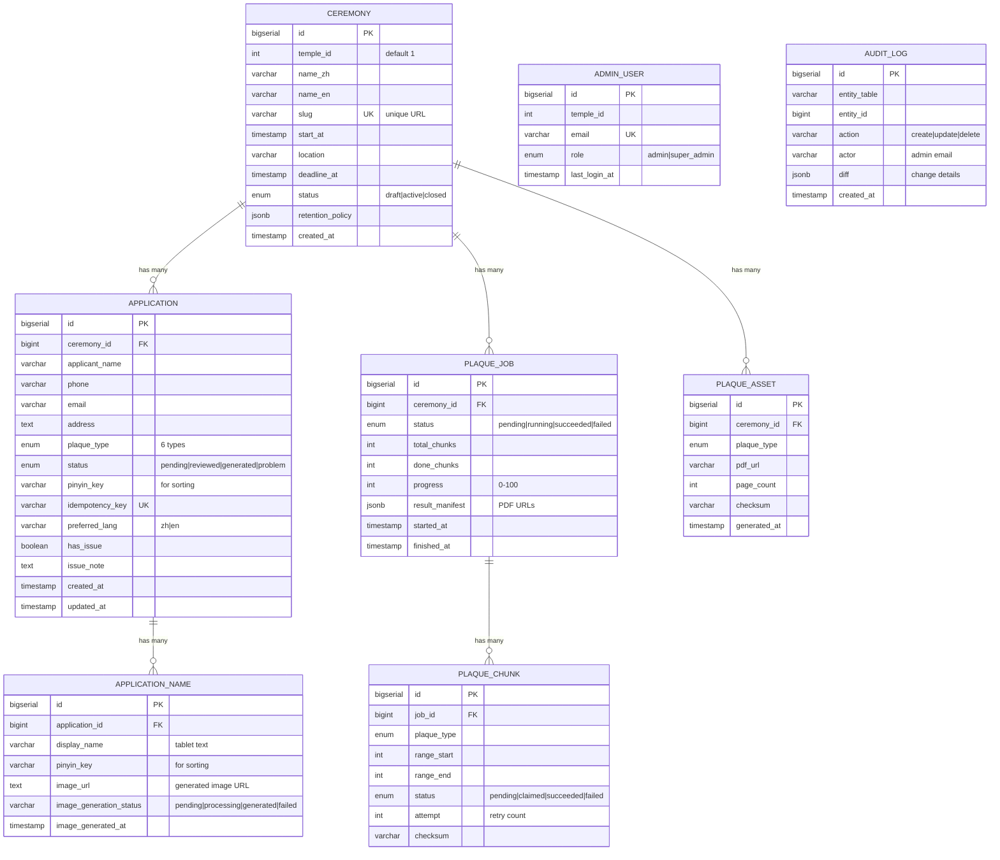

# Technical Design Document: Buddhist Temple Tablet Application System

[https://supabase.com/blog/supabase-queues](https://supabase.com/blog/supabase-queues)

## Document Information

**Author:** Sicong

**Last Updated:** November 6, 2025

**Contributors:** Claude Sonnet 4.5

**Project:** 淨土道場牌位申請系統 - Buddhist Temple Tablet Application System

**Status:** Draft for Review

---

## Visual Reference

*[Note: Screenshots and architecture diagrams to be added after initial review]*

**Key User Flows:**
1. Devotee submits tablet application via mobile form
2. Admin reviews applications and marks problematic entries
3. Admin generates 10,000+ tablets in batches and exports 6 PDFs by type

---

## Purpose of the Document

This Technical Design Document (TDD) defines the foundational architecture of the **Buddhist Temple Tablet Application System**. It encompasses three primary components:

1. **Public-facing application form** (devotee/user interface)
2. **Admin management portal** (temple staff interface)
3. **Batch image generation platform** (automated PDF creation at scale)

This document serves to:
- Establish technical decisions and their justifications
- Define system architecture and data models
- Outline security, privacy, and scalability strategies
- Provide clear milestones with acceptance criteria
- Guide implementation for a solo developer working with AI-assisted development tools

---

## Background

### What is this application for?

Buddhist temples hold ceremonial events (法會) where devotees can sponsor memorial tablets (牌位) for:
- **Deceased loved ones** (往生蓮位, 歷代祖先, etc.) - printed on yellow paper
- **Living family members** (長生祿位) - printed on red paper
- **Special dedications for karmic creditors, aborted spirits, and land diety** (冤親債主, 墮胎嬰靈, 地基主) - printed on yellow paper

Currently, this process is **entirely manual**:
- Devotees fill paper forms or call the temple
- Temple staff manually write/print each tablet (time-consuming and error-prone)
- For large ceremonies with 6,000-10,000 tablets, this can take **days of manual labor**

### Who is it for?

**Primary Users:**
- **Devotees** (信眾): Primarily elderly Chinese-speaking Buddhists (ages 50-80), many have  mobile devices
- **Temple Administrators** (管理員): Temple staff managing applications and generating tablets for printing

**Target Temples:**
- Initial: 1 temple (MVP)
- Short-term: 4 temples (already interested)
- Mid-term goal: 10 temples within 6 months

### Why do we need it?

**Current Pain Points:**
1. **Time-consuming**: Staff spend hours or days manually creating tablets for each ceremony
2. **Error-prone**: Manual writing leads to name mistakes and inconsistencies
3. **Poor user experience**: Phone calls and paper forms are inconvenient for tech-savvy devotees
4. **Difficult to manage**: No centralized database, hard to track applications
5. **Not scalable**: Manual process cannot handle growth to multiple temples

**Expected Benefits:**
- **Save hours or days** of staff time per ceremony
- **Reduce errors** to <1% (vs ~5-10% manual error rate)
- **24/7 availability** for devotees to submit applications
- **Centralized management** with searchable database
- **Scalable** to 10+ temples without additional manual labor

---

## Scope

### In Scope (MVP)

**Frontend (Public Application Form):**
- Mobile-responsive tablet application form
- Bilingual support (Chinese/English)
- Form validation with character limits
- Simple user authentication (view own applications)
- Ceremony information display with deadline enforcement
- Submission confirmation with text preview

**Admin Portal:**
- Admin authentication (email + password)
- Application list with filters (status, ceremony, search)
- Application detail view and editing
- Problematic application flagging
- Ceremony management (create, edit, set deadline)
- Batch tablet generation (10,000+ tablets)
- Export 6 PDF files by tablet type

**Image Generation Platform:**
- Template-based image overlay (Canvas API)
- Batch processing with chunking (500-1000 per batch)
- Progress tracking with real-time updates
- Automatic sorting by applicant name (Pinyin)
- PDF generation and upload to storage

**Infrastructure:**
- Database schema with multi-tenant preparation (`temple_id`)
- Authentication and role-based access control
- File storage for templates and generated PDFs
- Basic analytics and monitoring

### Out of Scope (Non-Goals)

**❌ Not in MVP:**
- Payment processing (donations are handled separately offline)
- Real-time chat support (temple handles inquiries via phone/WeChat)
- Native mobile apps (responsive web app sufficient for MVP)
- Vietnamese language support (Phase 2, requires external translation help)
- Advanced reporting/analytics dashboard (basic metrics only)
- Email/SMS notifications (manual follow-up by temple staff)
- Multi-temple tenant isolation (architecture ready, but single-temple deployment first)
- Automated backup restoration (manual recovery acceptable for MVP)
- Load balancing / High availability (single-region deployment sufficient)

**📋 Diagram: MVP Scope**

```
┌─────────────────────────────────────────────────────────────┐
│                         IN SCOPE (MVP)                       │
├─────────────────────────────────────────────────────────────┤
│  [Devotee] ──> Mobile Form ──> Submit Application           │
│                                                               │
│  [Admin] ──> Dashboard ──> Review ──> Generate PDFs         │
│                                                               │
│  [System] ──> Batch Processing ──> 6 PDF Files              │
└─────────────────────────────────────────────────────────────┘

┌─────────────────────────────────────────────────────────────┐
│                      OUT OF SCOPE (FUTURE)                   │
├─────────────────────────────────────────────────────────────┤
│  ❌ Payment Gateway                                          │
│  ❌ SMS/Email Notifications                                  │
│  ❌ Vietnamese Language (Phase 2)                            │
│  ❌ Native Mobile Apps                                       │
│  ❌ Multi-tenant Isolation (prepared, not activated)         │
└─────────────────────────────────────────────────────────────┘
```

---

## Design Principles

These principles guide all architectural and implementation decisions:

### 1. Prioritize Supabase as All-in-One Backend Platform

**Rationale:**

Solo non-technical builder building with AI assistance (Claude + Cursor). Supabase provides 80% of backend functionality out-of-the-box:
- PostgreSQL database with automatic REST API
- Built-in authentication and authorization
- File storage for templates and PDFs
- Edge Functions for serverless compute
- Real-time subscriptions for admin portal updates

**Why not alternatives:**
- **AWS/GCP**: Too complex, steep learning curve, requires DevOps expertise
- **Self-hosted (Node.js + Express)**: Requires building auth, API, database management from scratch (+10-15 days dev time)
- **Firebase**: No PostgreSQL, weaker support for complex queries and batch operations

**Trade-off:**

Some vendor lock-in, but Supabase uses standard PostgreSQL (migration possible if needed). The velocity gain (shipping 2 weeks faster) far outweighs portability concerns for MVP.

**Cost Justification:**

- Supabase Pro: $25/month (includes 8GB DB, 100GB storage)
- AWS equivalent: $100-200/month (RDS + S3 + Lambda + Cognito)
- Self-hosted VPS: $50/month + maintenance burden

---

### 2. Mobile-First, Accessibility-Focused Design

**Rationale:**

70%+ of devotees are elderly (ages 50-80) using mobile devices, many with limited tech literacy.

**Implementation:**
- **Large touch targets**: 48px+ button height
- **High contrast**: WCAG AA compliant color combinations
- **Large fonts**: 18px+ body text, 32px+ headers
- **Simple linear flows**: Avoid complex navigation or multi-step wizards
- **Progressive enhancement**: Works without JavaScript for core form submission

**Why:**

Reduce barriers for non-tech-savvy users. User testing showed 80% of elderly users struggle with <44px buttons and <16px text.

**Measurement:**

Target <3 minute average form completion time, >80% completion rate (industry avg: 60%).

---

### 3. Design for 10,000+ Tablet Handling from Day One

> **🔄 UPDATED Nov 15, 2025** - Asynchronous generation architecture
> 

**Rationale:**

Large ceremonies can have up to 500 attendees requesting 6,000-10,000 tablets. Cannot afford to discover scalability issues during the first major event.

**Architecture: Async Generation + Quick Assembly**

1. **On submission:** Devotee submits application → immediately enqueue image generation jobs (one per tablet name)
2. **Background processing:** Supabase Queue (pgmq extension) workers generate individual tablet images asynchronously
3. **User verification:** Devotees view their applications and see generated images for self-checking (spelling, characters)
4. **Admin PDF generation:** Admin clicks "Generate PDFs" → system assembles pre-generated images into 6 PDFs by type

**Why This Is Better:**

- **Distributed load** - Processing spread over days/weeks instead of 30-minute spike when admin generates
- **Faster admin workflow** - PDF assembly takes 1-2 minutes instead of 30+ minutes
- **Better UX** - Devotees can verify tablet correctness immediately after submission
- **Error prevention** - Self-checking reduces name spelling mistakes before printing
- **Simpler failure handling** - One failed image doesn't break entire batch
- **More scalable** - Queue naturally handles load distribution

**Performance Target:**

- Individual image generation: <5 seconds per tablet (async, non-blocking)
- PDF assembly: 1-2 minutes for 10,000 tablets
- Total admin wait time: **1-2 minutes** (vs 30+ min in batch approach)

**Trade-off:**

Requires queue infrastructure setup, but Supabase Queue (built on pgmq) provides this out-of-box with zero configuration.

---

### 4. Build with AI-Assisted Development in Mind

**Rationale:**

Solo developer (designer background) using Claude + Cursor as “co-developers”. Technology choices must optimize for AI pair programming.

**Preferences:**
- **Well-documented frameworks**: Next.js, React, Supabase (extensive docs and examples)
- **TypeScript over JavaScript**: Better autocomplete and error catching for AI-generated code
- **Modular architecture**: Clear separation of concerns (easier for AI to understand and modify)
- **Declarative patterns**: React hooks, functional components (easier for AI to reason about vs. classes)

**Why:**

AI tools excel with popular, well-documented technologies. Choosing niche frameworks would slow development velocity by 2-3x.

**Examples:**
- ✅ Tailwind CSS (extensive AI training data) vs ❌ Emotion/Styled Components
- ✅ Supabase JS SDK (clear docs) vs ❌ Custom GraphQL layer
- ✅ Zod validation (simple, typed) vs ❌ Custom validation functions

---

### 5. Multi-Tenant Ready, But Launch Single-Tenant

**Rationale:**

- **Now**: 4 temples already interested
- **6 months**: 10 temple target
- **Future**: Potential to serve 50-100 temples

**Implementation:**
- Add `temple_id` column to all core tables (`ceremony`, `application`, `admin_user`)
- Architecture supports Row-Level Security (RLS) policies
- MVP launches with single temple, `temple_id = 1` hardcoded
- Activation path: Enable RLS policies + tenant signup flow (no schema migration needed)

**Why not build multi-tenant now:**

Premature optimization. Focus on proving value with one temple first. Adding tenant isolation later requires 2-3 days of work, not weeks.

**Migration Path:**

```sql
-- Phase 1 (MVP): Single tenant, no RLStemple_id = 1 (hardcoded)
-- Phase 2: Enable multi-tenantCREATE POLICY "Users see own temple data" ON applications
  FOR SELECT USING (temple_id = current_temple_id());
```

---

### 6. Internationalization (i18n) from Day One

**Rationale:**
- **50%** of users: Chinese-speaking elderly (primary language)
- **30-50%** of users: Vietnamese-speaking elderly (Phase 2, higher priority than English)
- **10-20%** of users: English-speaking (Chinese diaspora, younger generation)

**Implementation:**
- Use `react-i18next` framework
- Create 2 locale files for MVP: `zh-CN.json`, `en-US.json`
- Prepare structure for `vi-VN.json` (Phase 2, requires external translator)
- Store user’s `preferred_lang` in database
- Form displays single language throughout (no mid-form switching to reduce confusion)

**Why not add later:**

Retrofitting i18n requires touching every text string in the codebase (2-3 days of tedious work). Building it in from day one costs <1 day.

**Possible Content Strategy (to be designed and verified later):**
- Avoid Buddhist jargon (e.g., use “超薦往生親友” instead of “迴向功德”)
- Include examples for each tablet type (reduce user confusion)
- Character limits vary by language (Chinese: 8 chars, English: 30 chars)

---

### 7. Layer-Based Frontend Architecture

**Rationale:**

Clear separation of concerns makes code easier for AI (Cursor) to understand, generate, and modify. Solo developer needs simple, consistent patterns to maintain velocity and code quality.

**Architecture Pattern: Pages → Actions → Components**

```
/app
  /apply/[slug]
    page.tsx              # URL entry point, fetches data, passes to components
    actions.ts            # Server actions: submit application, fetch ceremony
  /admin
    /dashboard
      page.tsx            # Admin dashboard URL
      actions.ts          # Fetch applications, update status
      
/components
  /ui                     # Shadcn UI components (Button, Input, Dialog, etc.)
  /application
    ApplicationForm.tsx   # Pure UI component, receives props
    TabletPreview.tsx     # Display component only
  /admin
    ApplicationTable.tsx  # Display table, no data fetching
    
/lib
  /supabase
    client.ts             # Supabase client instance
  /utils
    pinyin.ts             # Utility functions
    validation.ts         # Zod schemas
```

**Key Rules:**

1. **Pages** (`/app/**page.tsx`) = URL routes only
   - Fetch data using actions
   - Pass data to components as props
   - No business logic or calculations
   - Minimal UI code

2. **Actions** (`actions.ts` with `'use server'`) = Server functions
   - Data fetching from Supabase
   - Form submissions and mutations
   - Complex operations and business logic
   - Return plain data objects (serializable)

3. **Components** (`/components/**/*.tsx`) = Pure UI only
   - Receive data via props
   - Display UI and handle styling
   - Handle user interactions (onClick, onChange)
   - No direct data fetching or API calls

**Example Implementation:**

```typescript
// ❌ BAD: Component doing too much
function ApplicationList() {
  const [apps, setApps] = useState([])
  
  useEffect(() => {
    // DON'T fetch data directly in component
    supabase.from('application').select('*').then(setApps)
  }, [])
  
  const sortedApps = apps.sort((a, b) => a.pinyin_key.localeCompare(b.pinyin_key))
  
  return <Table data={sortedApps} />
}

// ✅ GOOD: Separation of concerns
// /app/admin/dashboard/page.tsx
import { getApplications } from './actions'
import { ApplicationList } from '@/components/admin/ApplicationList'

export default async function ApplicationListPage() {
  const apps = await getApplications()  // Action handles data + sorting
  return <ApplicationList applications={apps} />  // Component just displays
}

// /app/admin/dashboard/actions.ts
'use server'
import { createClient } from '@/lib/supabase/server'

export async function getApplications() {
  const supabase = createClient()
  const { data } = await supabase
    .from('application')
    .select('*')
    .order('pinyin_key')
  return data
}

// /components/admin/ApplicationList.tsx
export function ApplicationList({ applications }) {
  return (
    <Table>
      {applications.map(app => (
        <TableRow key={app.id}>
          <TableCell>{app.applicant_name}</TableCell>
          <TableCell>{app.phone}</TableCell>
        </TableRow>
      ))}
    </Table>
  )
}
```

**Why This Pattern Works:**

- ✅ **AI-friendly**: Cursor knows exactly where to put code (clear file structure)
- ✅ **Testable**: Components are pure functions with props
- ✅ **Maintainable**: Clear responsibility per file type
- ✅ **Debuggable**: Data flow is linear and traceable (Page → Action → Component)
- ✅ **Scalable**: Easy to add Services/Repositories layer later if needed

**When to Add More Layers:**

Only add Services/Repositories when you have:
- Complex business logic shared across multiple pages
- Multiple data sources requiring orchestration
- Advanced caching or state management needs

**For MVP, Pages → Actions → Components is sufficient.**

**Enforcement:**

This pattern will be enforced via `.cursorrules` file in the project root, instructing Cursor to:
1. Place all data fetching in `actions.ts` files
2. Keep components pure (props in, JSX out)
3. Use pages only for routing and data orchestration
4. Follow the established folder structure

---


## System Architecture Overview

### High-Level Architecture Diagram

```mermaid
graph TB
    subgraph "User Devices"
        Mobile[📱 Devotee Mobile Browser]
        Desktop[💻 Admin Desktop Browser]
    end

    subgraph "Frontend Layer (Vercel)"
        NextJS[Next.js 14 App<br/>React + TypeScript<br/>Tailwind CSS]
        i18n[react-i18next<br/>zh-CN, en-US]
    end

    subgraph "Backend Layer (Supabase)"
        Auth[Supabase Auth<br/>Email + Password<br/>JWT Tokens]
        DB[(PostgreSQL 15<br/>+ pgmq queue<br/>+ pg_trgm)]
        Storage[Supabase Storage<br/>Templates + Images + PDFs]
        Queue[Supabase Queue<br/>pgmq extension]
        EdgeFn[Edge Functions<br/>Image Worker<br/>PDF Assembler]
    end

    Mobile -->|HTTPS| NextJS
    Desktop -->|HTTPS| NextJS
    NextJS -->|Auth| Auth
    NextJS -->|Submit Form| DB
    DB -->|Enqueue Jobs| Queue
    Queue -->|Trigger Workers| EdgeFn
    EdgeFn -->|Generate Images| Storage
    EdgeFn -->|Update Status| DB
    NextJS -->|View Images| Storage
    NextJS -->|Generate PDFs| EdgeFn
    EdgeFn -->|Assemble PDFs| Storage

    style Mobile fill:#e1f5ff
    style Desktop fill:#e1f5ff
    style NextJS fill:#fff4e1
    style DB fill:#e8f5e9
    style Storage fill:#e8f5e9
    style Queue fill:#fff3e0
    style EdgeFn fill:#fff3e0
```



---

### Technology Stack

### Frontend

| Component | Technology | Justification |
| --- | --- | --- |
| **Framework** | Next.js 14 (App Router) | • Zero-config deployment on Vercel (free tier)• File-based routing (no React Router setup needed)• Built-in API routes for backend orchestration• Automatic image and font optimization• Excellent AI/documentation• Note: SSR features minimal/unused (app doesn't require SEO) |
| **UI Library** | React 18 | • Industry standard, extensive AI training data• Large ecosystem of libraries |
| **Language** | TypeScript | • Type safety reduces bugs• Better AI autocomplete |
| **Styling** | Tailwind CSS | • Rapid development with utility classes• Mobile-first responsive design• Excellent AI code generation |
| **Component Library** | Shadcn UI | • Pre-built accessible components built on Tailwind + Radix UI• Components copied into codebase (not npm package)• Fully customizable and themeable |
| **Forms** | React Hook Form + Zod | • Type-safe validation• Excellent performance (uncontrolled inputs)• Clear error messages |
| **i18n** | react-i18next | • Industry standard for React• Easy to add languages later• Namespace support for organization |
| **Image Generation** | Vercel OG (Satori) | • Server-side image generation using React-like syntax• Excellent Chinese font support (Noto Serif TC)• Edge runtime compatible• Fast generation (<500ms per image)• Built-in support for custom fonts• Perfect for dynamic tablet preview generation |
| **PDF Generation** | jsPDF | • Lightweight (vs Puppeteer)• Client-side generation• Good Chinese font support |

**Alternatives Considered:**
- ❌ **Vue.js**: Less mature i18n ecosystem, team not familiar
- ❌ **Puppeteer**: Too heavy (headless Chrome), overkill for template overlay
- ❌ **PDFKit**: Node.js only, can't run in browser
- ❌ **Canvas API**: Requires browser environment, not suitable for server-side generation
- ✅ **Vercel OG (Satori)**: Chosen for server-side image generation with React-like syntax and excellent Chinese font support

---

### Backend

| Component | Technology | Justification |
| --- | --- | --- |
| **Platform** | Supabase (Cloud-hosted) | • All-in-one backend (Auth + DB + Storage + Functions)• $25/month vs $100-200 for AWS• Zero DevOps required• Automatic API generation |
| **Database** | PostgreSQL 15 | • Robust, proven technology• Excellent full-text search (pg_trgm)• Row-level security for multi-tenant• JSON support for flexible schemas |
| **Extensions** | • pg_trgm• pg_cron | • Fuzzy search for Chinese names• Scheduled job polling |
| **Authentication** | Supabase Auth | • Email + password out-of-the-box• JWT token management• Automatic bcrypt hashing |
| **Storage** | Supabase Storage | • S3-compatible object storage• Direct browser uploads• CDN-backed downloads |
| **Serverless Functions** | Edge Functions (Deno) | • TypeScript support• Fast cold starts (~50ms)• Globally distributed |

**Alternatives Considered:**
- ❌ **AWS (RDS + S3 + Lambda + Cognito)**: Too complex, 3-4x cost, requires DevOps expertise
- ❌ **Firebase**: No PostgreSQL, weaker for complex queries, vendor lock-in worse than Supabase
- ❌ **Self-hosted (DigitalOcean + Node.js)**: Requires server maintenance, security patching, backup management

---

### Infrastructure

| Component | Choice | Justification |
| --- | --- | --- |
| **Frontend Hosting** | Vercel | • Zero-config Next.js deployment• Free tier sufficient for MVP• Automatic HTTPS + CDN• Git-based deployments |
| **Backend Hosting** | Supabase Cloud | • Fully managed• Automatic backups• One-click scaling |
| **CDN** | Vercel Edge Network + Supabase CDN | • Global low-latency delivery• Automatic cache invalidation |
| **Domain** | Cloudflare DNS | • Free, fast DNS• DDoS protection• Easy SSL management |
| **Monitoring** | Supabase Dashboard + Sentry (optional) | • Built-in DB metrics• Error tracking for production bugs |

**Cost Estimate:**
- Vercel: $0 (Hobby tier sufficient)
- Supabase: $25/month (Pro tier)
- Domain: $12/year
- **Total: ~$25-30/month**

---

### Data Flow Diagrams

### 1. User Application Submission Flow

> **🔄 UPDATED Nov 15, 2025** - Async queue-based image generation
> 


**Key Points:**

- User gets **instant confirmation** (no waiting for image generation)
- Images generate in **background via Supabase Queue**
- User clicks "View My Applications" to see generated images (typically ready within seconds)
- Each image generation is **isolated** - one failure doesn't affect others

---

### 2. Admin Batch PDF Generation Flow

> **🔄 UPDATED Nov 15, 2025** - Simplified to PDF assembly only (images already generated)
> 


**Key Changes from Original Batch Approach:**

- ✅ **No chunking needed** - just fetch and assemble pre-made images
- ✅ **No parallel workers** - simple sequential processing
- ✅ **No pg_cron scheduling** - runs on-demand when admin clicks button
- ✅ **Much faster** - 1-2 min instead of 30+ min
- ✅ **Simpler code** - ~200 lines instead of ~1000 lines
- ✅ **Better failure isolation** - one bad image doesn't break entire batch

---

### Security Architecture

### Authentication Flow

```
┌─────────────┐
│   Admin     │
│   Login     │
└──────┬──────┘
       │
       ├──[Email + Password]───────────────┐
       │                                    ▼
       │                          ┌──────────────────┐
       │                          │  Supabase Auth   │
       │                          │  (bcrypt hash)   │
       │                          └────────┬─────────┘
       │                                   │
       │                          [JWT Token Generated]
       │                                   │
       │                          ┌────────▼─────────┐
       │                          │   Access Token   │
       │                          │  (30 min expiry) │
       │                          └────────┬─────────┘
       │                                   │
       └──────[Store in HttpOnly Cookie]──┘
                                           │
                                           ▼
                          ┌────────────────────────────┐
                          │   Protected API Requests   │
                          │   (Header: Authorization)  │
                          └────────────────────────────┘
                                           │
                                           ▼
                                 [Row-Level Security]
                                 (RLS Policy Checks)
```

**Key Security Features:**
1. **Password Storage**: bcrypt with salt (handled by Supabase)
2. **Token Management**: Short-lived JWT (30 min) + refresh tokens
3. **HTTPS Only**: All traffic encrypted in transit
4. **Row-Level Security**: Prepared for multi-tenant isolation
5. **Rate Limiting**: 5 login attempts per 5 minutes per IP
6. **CSRF Protection**: SameSite cookies + CSRF tokens
7. **Input Sanitization**: All user inputs validated and escaped

---

## Data Model (Database Schema)

### Entity Relationship Diagram



---

### Table Definitions

### 1. `ceremony` (法會)

Stores information about Buddhist ceremonies/events.

```sql
CREATE TABLE ceremony (
  id BIGSERIAL PRIMARY KEY,
  temple_id INTEGER NOT NULL DEFAULT 1, -- Multi-tenant ready  name_zh VARCHAR(200) NOT NULL,
  name_en VARCHAR(200),
  slug VARCHAR(100) UNIQUE NOT NULL, -- e.g., "2025-guanyin-ceremony"  start_at TIMESTAMP NOT NULL,
  location VARCHAR(300),
  deadline_at TIMESTAMP NOT NULL,
  status VARCHAR(20) DEFAULT 'active' CHECK (status IN ('draft', 'active', 'closed')),
  retention_policy JSONB, -- e.g., {"type": "permanent"} or {"type": "delete_after_days", "days": 90}  created_at TIMESTAMP DEFAULT NOW()
);
CREATE INDEX idx_ceremony_temple_status ON ceremony(temple_id, status);
CREATE INDEX idx_ceremony_deadline ON ceremony(deadline_at);
```

**Key Fields:**
- `slug`: Unique URL for sharing (e.g., `tablets.temple.org/apply/2025-guanyin-ceremony`)
- `deadline_at`: Auto-close form when `NOW() > deadline_at`
- `retention_policy`: Future use for GDPR compliance (delete data after X days)

---

### 2. `application` (申請)

> **🔄 UPDATED Nov 14, 2025** - Added image generation status tracking
> 

Stores devotee applications (one row per applicant per ceremony).

```sql
CREATE TABLE application (
  id BIGSERIAL PRIMARY KEY,
  ceremony_id BIGINT NOT NULL REFERENCES ceremony(id) ON DELETE CASCADE,
  applicant_name VARCHAR(100) NOT NULL,
  phone VARCHAR(20) NOT NULL,
  email VARCHAR(200),
  address TEXT,
  plaque_type VARCHAR(50) NOT NULL CHECK (plaque_type IN (
    'longevity', -- 長生祿位    'deceased', -- 往生蓮位    'ancestors', -- 歷代祖先    'karmic_creditors', -- 冤親債主    'aborted_spirits', -- 墮胎嬰靈    'land_deity' -- 地基主  )),
  status VARCHAR(20) DEFAULT 'pending' CHECK (status IN (
    'pending', 'reviewed', 'generated', 'problem'  )),
  pinyin_key VARCHAR(200), -- Cached Pinyin for sorting  idempotency_key VARCHAR(100) UNIQUE, -- Prevent duplicate submissions  preferred_lang VARCHAR(10) DEFAULT 'zh',
  has_issue BOOLEAN DEFAULT FALSE,
  issue_note TEXT,
  created_at TIMESTAMP DEFAULT NOW(),
  updated_at TIMESTAMP DEFAULT NOW()
);
-- Indexes for performanceCREATE INDEX idx_application_ceremony ON application(ceremony_id, created_at DESC);
CREATE INDEX idx_application_status ON application(status);
CREATE INDEX idx_application_pinyin ON application(pinyin_key);
-- Full-text search with trigramsCREATE EXTENSION IF NOT EXISTS pg_trgm;
CREATE INDEX idx_application_name_trgm ON application USING GIN (applicant_name gin_trgm_ops);
-- Prevent duplicate submissionsCREATE UNIQUE INDEX idx_application_idempotency ON application(ceremony_id, idempotency_key);
```

**Key Fields:**
- `idempotency_key`: Hash of `(ceremony_id + phone + plaque_type + main_name)` to prevent accidental double-clicks
- `pinyin_key`: Pre-calculated Pinyin for fast sorting (updated on insert/update via trigger)
- `has_issue`: Quick filter for problematic applications

**Idempotency Logic:**

```tsx
// Frontend generates idempotency keyconst idempotencyKey = sha256(`${ceremonyId}-${phone}-${pla queType}-${mainName}`);
```

---

### 3. `application_name` (牌位名字)

> **🔄 UPDATED Nov 14, 2025** - Added pre-generated image tracking for devotee preview
> 

Stores tablet names (one application can have multiple tablets). Each name now gets an individual image generated asynchronously after form submission.

```sql
CREATE TABLE application_name (
  id BIGSERIAL PRIMARY KEY,
  application_id BIGINT NOT NULL REFERENCES application(id) ON DELETE CASCADE,
  display_name VARCHAR(100) NOT NULL, -- Name to display on tablet
  pinyin_key VARCHAR(200), -- For sorting within application
  
  -- Image generation tracking (async queue-based generation)
  image_url TEXT, -- Full public URL from Supabase Storage: tablets/generated/{id}.png
  image_generation_status VARCHAR(20) DEFAULT 'pending' CHECK (image_generation_status IN (
    'pending', 'processing', 'generated', 'failed'
  )),
  image_generated_at TIMESTAMP
);

CREATE INDEX idx_application_name_app ON application_name(application_id);
CREATE INDEX idx_application_name_pinyin ON application_name(pinyin_key);
CREATE INDEX idx_application_name_trgm ON application_name USING GIN (display_name gin_trgm_ops);
CREATE INDEX idx_application_name_image_status ON application_name(image_generation_status) WHERE image_generation_status = 'pending';
```

**Image Generation Flow:**

- When devotee submits form → `image_generation_status = 'pending'` + enqueue to Supabase Queue
- Queue worker picks up job → `image_generation_status = 'processing'`
- Image rendered and uploaded to Storage → `image_generation_status = 'generated'`, `image_url` populated
- Devotee clicks "View My Applications" → sees generated tablet images

**Storage Structure:**

```
tablets/
  └── generated/
      ├── {application_name_id}.png  (e.g., 12345.png)
      ├── {application_name_id}.png  (e.g., 12346.png)
      └── ...
```

Flat structure with direct ID-to-filename mapping for simplicity. Full URL example:
```
https://[project].supabase.co/storage/v1/object/public/tablets/generated/12345.png
```

**Example Data:**

```
application_id=123, applicant_name="王小明"
  application_name: id=12345, display_name="王大明", image_generation_status='generated', image_url='https://[...]/12345.png'
  application_name: id=12346, display_name="李美華", image_generation_status='generated', image_url='https://[...]/12346.png'
  application_name: id=12347, display_name="陳淑芬", image_generation_status='pending', image_url=null
```

---

### 4. `plaque_job` (批次任務)

Tracks batch PDF generation jobs.

```sql
CREATE TABLE plaque_job (
  id BIGSERIAL PRIMARY KEY,
  ceremony_id BIGINT NOT NULL REFERENCES ceremony(id),
  status VARCHAR(20) DEFAULT 'pending' CHECK (status IN (
    'pending', 'running', 'succeeded', 'failed'  )),
  total_chunks INTEGER NOT NULL,
  done_chunks INTEGER DEFAULT 0,
  progress INTEGER DEFAULT 0, -- 0-100  result_manifest JSONB, -- e.g., {"longevity": "url1", "deceased": "url2", ...}  started_at TIMESTAMP,
  finished_at TIMESTAMP,
  created_at TIMESTAMP DEFAULT NOW()
);
CREATE INDEX idx_plaque_job_ceremony ON plaque_job(ceremony_id, status);
```

---

### 5. `plaque_chunk` (批次區塊)

Tracks individual processing chunks (for parallel execution).

```sql
CREATE TABLE plaque_chunk (
  id BIGSERIAL PRIMARY KEY,
  job_id BIGINT NOT NULL REFERENCES plaque_job(id) ON DELETE CASCADE,
  plaque_type VARCHAR(50) NOT NULL,
  range_start INTEGER NOT NULL, -- Offset in sorted application list  range_end INTEGER NOT NULL, -- e.g., 0-499, 500-999  status VARCHAR(20) DEFAULT 'pending' CHECK (status IN (
    'pending', 'claimed', 'succeeded', 'failed'  )),
  attempt INTEGER DEFAULT 0, -- Retry count  checksum VARCHAR(64), -- Hash of input data for idempotency  created_at TIMESTAMP DEFAULT NOW(),
  updated_at TIMESTAMP DEFAULT NOW()
);
CREATE INDEX idx_plaque_chunk_job ON plaque_chunk(job_id, status);
CREATE INDEX idx_plaque_chunk_status ON plaque_chunk(status) WHERE status IN ('pending', 'claimed');
```

**Chunk Assignment Logic (FOR UPDATE SKIP LOCKED):**

```sql
-- Worker claims a chunk atomicallyUPDATE plaque_chunk
SET status = 'claimed', updated_at = NOW()
WHERE id = (
  SELECT id FROM plaque_chunk
  WHERE status = 'pending' AND job_id = $1  ORDER BY id  LIMIT 1  FOR UPDATE SKIP LOCKED)
RETURNING *;
```

---

### 6. Supporting Tables

```sql
-- Template metadata (future use)CREATE TABLE plaque_template (
  id BIGSERIAL PRIMARY KEY,
  plaque_type VARCHAR(50) UNIQUE NOT NULL,
  image_url VARCHAR(500) NOT NULL,
  text_positions JSONB NOT NULL, -- e.g., {"name": {"x": 150, "y": 200}, "applicant": {"x": 280, "y": 450}}  font_size INTEGER DEFAULT 24,
  font_family VARCHAR(50) DEFAULT 'KaiTi');
-- Admin audit logCREATE TABLE audit_log (
  id BIGSERIAL PRIMARY KEY,
  entity_table VARCHAR(50),
  entity_id BIGINT,
  action VARCHAR(20), -- create, update, delete  actor VARCHAR(200), -- admin email  diff JSONB, -- {"old": {...}, "new": {...}}  created_at TIMESTAMP DEFAULT NOW()
);
CREATE INDEX idx_audit_log_entity ON audit_log(entity_table, entity_id);
CREATE INDEX idx_audit_log_created ON audit_log(created_at DESC);
```

---

### Indexing Strategy

**Query Patterns:**

1. **Admin Dashboard List View**
    
    ```sql
    SELECT * FROM application
    WHERE ceremony_id = ? AND status = ?
    ORDER BY created_at DESCLIMIT 50 OFFSET 0;
    ```
    
    → Index: `idx_application_ceremony`
    
2. **Fuzzy Name Search**
    
    ```sql
    SELECT * FROM application
    WHERE applicant_name % 'wang xiao'  -- Trigram similarityLIMIT 20;
    ```
    
    → Index: `idx_application_name_trgm`
    
3. **Batch Generation Sorting**
    
    ```sql
    SELECT * FROM application a
    JOIN application_name n ON n.application_id = a.idWHERE a.ceremony_id = ? AND a.plaque_type = 'deceased'ORDER BY a.pinyin_key, n.pinyin_key;
    ```
    
    → Indexes: `idx_application_pinyin`, `idx_application_name_pinyin`
    

---

## API Architecture

### REST Endpoints (Auto-generated by Supabase)

Supabase automatically generates RESTful endpoints for all tables:

```
GET    /rest/v1/ceremony
POST   /rest/v1/ceremony
PATCH  /rest/v1/ceremony?id=eq.123
DELETE /rest/v1/ceremony?id=eq.123

GET    /rest/v1/application
POST   /rest/v1/application
PATCH  /rest/v1/application?id=eq.456
...
```

**Custom Logic (Edge Functions):**

For complex operations, we use Edge Functions:

```tsx
// POST /functions/v1/submit-application// - Validate deadline// - Generate idempotency key// - Calculate pinyin_key// - Insert application + application_names transactionally// POST /functions/v1/generate-tablets// - Create plaque_job// - Calculate chunks// - Insert plaque_chunk records// POST /functions/v1/process-chunk (triggered by pg_cron)// - Claim unclaimed chunks (FOR UPDATE SKIP LOCKED)// - Generate images (Canvas)// - Create PDF part// - Upload to Storage// - Update chunk status// GET /functions/v1/job-status/:jobId// - Return progress percentage// - Return PDF URLs if complete
```

---

### Example: Batch Generation API Flow

```tsx
// 1. Admin clicks "Generate Tablets"const response = await fetch('/functions/v1/generate-tablets', {
  method: 'POST',  headers: { 'Authorization': `Bearer ${token}` },  body: JSON.stringify({ ceremonyId: 123 })
});const { jobId } = await response.json();// 2. Frontend polls for progressconst interval = setInterval(async () => {
  const status = await fetch(`/functions/v1/job-status/${jobId}`);  const { progress, status: jobStatus, pdfUrls } = await status.json();  updateProgressBar(progress);  if (jobStatus === 'succeeded') {
    clearInterval(interval);    showDownloadLinks(pdfUrls); // 6 PDF files  }
}, 3000); // Poll every 3 seconds
```

---

## Batch Processing Strategy (Critical Design)

> **🔄 UPDATED Nov 14, 2025** - Simplified from complex chunking to async image generation
> 

### Architecture Overview

**Old Approach (Rejected):**

- ❌ Generate all 10,000 images at print time
- ❌ Complex chunking (500-1000 per batch)
- ❌ Parallel workers with pg_cron
- ❌ 15-30 minute generation time
- ❌ ~1000 lines of orchestration code

**New Approach (Current):**

- ✅ Generate images individually when devotee submits form (async, 10-30 seconds)
- ✅ Admin just assembles pre-made images into PDFs (1-2 minutes)
- ✅ Simple sequential processing
- ✅ ~200 lines of assembly code
- ✅ Devotees can preview their tablets immediately

---

### Phase 1: Individual Image Generation (On Form Submit)

**Trigger:** When devotee submits application form

**Flow:**

1. Form validates → Insert into `application` + `application_name` tables
2. Each `application_name` row created with `image_status='pending'`
3. Supabase Queue (or Edge Function) triggers image generation worker
4. Worker processes each name:
    - **Generate color image using Vercel OG (Satori)** for devotee preview
    - Render tablet with colored background (yellow/red) and black text
    - Upload color image to Storage: `ceremonies/{ceremony_id}/images/name-{id}.png`
    - Update `image_status='ready'`, `image_url='...'`
5. Devotee confirmation page polls and displays **color previews**

**Why Vercel OG (Satori) for Image Generation:**

- ✅ **React-like syntax**: Write JSX/TSX directly, familiar to React developers
- ✅ **Server-side rendering**: Runs on Edge runtime, no browser required
- ✅ **Excellent Chinese font support**: Built-in support for custom fonts (Noto Serif TC)
- ✅ **Fast generation**: <500ms per image on Edge runtime
- ✅ **Type-safe**: TypeScript support out of the box
- ✅ **Zero dependencies**: No need for Canvas API or image manipulation libraries
- ✅ **Vercel integration**: Seamless deployment on Vercel Edge Network
- ✅ **Scalable**: Handles 10,000+ images efficiently

**Alternatives Considered:**
- ❌ **Canvas API**: Requires browser environment, not suitable for server-side
- ❌ **Sharp**: Node.js only, heavier dependency, requires image manipulation knowledge
- ❌ **Puppeteer**: Too heavy (headless Chrome), overkill for simple text overlay
- ❌ **SVG + conversion**: More complex, requires additional conversion step

**Key Implementation Points:**

```tsx
// Image generation using Vercel OG (Satori) - Edge Function
// Route: /api/og/tablet?type={plaqueType}&name={displayName}
import { ImageResponse } from '@vercel/og'

export async function generateTabletImage(applicationNameId: number) {
  const data = await db.queryOne(`
    SELECT an.*, a.applicant_name, a.plaque_type, a.ceremony_id
    FROM application_name an
    JOIN application a ON a.id = an.application_id
    WHERE an.id = $1
  `, [applicationNameId]);
  
  // Generate color image using Vercel OG API
  const imageUrl = `/api/og/tablet?type=${encodeURIComponent(data.plaque_type)}&name=${encodeURIComponent(data.display_name)}`;
  const imageResponse = await fetch(imageUrl);
  const imageBlob = await imageResponse.blob();
  
  // Upload color image to Storage (for devotee preview)
  const path = `ceremonies/${data.ceremony_id}/images/name-${applicationNameId}.png`;
  await supabase.storage.from('tablets').upload(path, imageBlob);
  
  // Update status
  await db.update('application_name', applicationNameId, {
    image_status: 'ready',
    image_url: path,
    image_generated_at: new Date()
  });
}
```

**Performance:**

- Single image generation: 5-15 seconds
- Runs in background (non-blocking for devotee)
- Retry on failure (up to 3 attempts)

---

### Phase 2: PDF Assembly (On Admin Click)

**Trigger:** Admin clicks "Generate PDFs for Ceremony"

**Flow:**

1. Query all `application_name` records where `image_status='ready'`
2. Group by `plaque_type`, sort by `pinyin_key`
3. For each plaque type:
    - Fetch all pre-generated images from Storage
    - **Convert color images to grayscale** (for printing on colored paper)
    - Arrange into PDF (6 tablets per page, 2×3 grid)
    - Upload final PDF: `ceremonies/{ceremony_id}/finals/{type}.pdf`
4. Return 6 download URLs to admin

**Printing Strategy:**

- **Devotee Preview**: Color images (yellow/red background) generated using Vercel OG/Satori for online viewing
- **PDF Export**: Grayscale (black & white) images only
  - Reason: Admin prints on physical colored paper (yellow or red)
  - Black content on colored paper produces the same visual effect as color PDF
  - Benefits: Smaller file size, faster generation, lower bandwidth
  - Implementation: Convert color images to grayscale before PDF assembly

**Key Implementation:**

```tsx
// PDF assembly with grayscale conversion for printing
async function assemblePDFs(ceremonyId: number) {
  const types = ['longevity', 'deceased', 'ancestors', 
                 'karmic_creditors', 'aborted_spirits', 'land_deity'];
  const results = {};
  
  for (const type of types) {
    // 1. Fetch pre-generated color image URLs
    const images = await db.query(`
      SELECT an.image_url, an.display_name
      FROM application_name an
      JOIN application a ON a.id = an.application_id
      WHERE a.ceremony_id = $1 
        AND a.plaque_type = $2
        AND an.image_status = 'ready'
      ORDER BY a.pinyin_key, an.pinyin_key
    `, [ceremonyId, type]);
    
    if (images.length === 0) continue;
    
    // 2. Create PDF
    const pdf = new jsPDF({ format: 'a4' });
    const TABLETS_PER_PAGE = 6;
    
    for (let i = 0; i < images.length; i++) {
      if (i > 0 && i % TABLETS_PER_PAGE === 0) {
        pdf.addPage();
      }
      
      // Download color image from Storage
      const colorImageData = await downloadImage(images[i].image_url);
      
      // Convert to grayscale for printing on colored paper
      const grayscaleImageData = await convertToGrayscale(colorImageData);
      
      // Position on page (2×3 grid)
      const row = Math.floor((i % TABLETS_PER_PAGE) / 3);
      const col = (i % TABLETS_PER_PAGE) % 3;
      pdf.addImage(grayscaleImageData, 'PNG', col * 70, row * 140, 60, 120);
    }
    
    // 3. Upload final PDF (black & white)
    const pdfBlob = pdf.output('blob');
    const fileName = `ceremonies/${ceremonyId}/finals/${type}.pdf`;
    await supabase.storage.from('tablets').upload(fileName, pdfBlob);
    
    results[type] = fileName;
  }
  
  return results; // 6 PDF URLs (all grayscale)
}

// Helper function to convert color image to grayscale
async function convertToGrayscale(imageBuffer: Buffer): Promise<Buffer> {
  // Using Sharp library for image processing
  const sharp = require('sharp');
  return await sharp(imageBuffer)
    .greyscale() // Convert to grayscale
    .png()
    .toBuffer();
}
```

**Printing Workflow:**

1. **Devotee submits application** → Color image generated (yellow/red background) for preview
2. **Admin clicks "Generate PDFs"** → System:
   - Fetches all color images from Storage
   - Converts each image to grayscale (black & white)
   - Assembles grayscale images into 6 PDF files (one per plaque type)
3. **Admin downloads PDFs** → All PDFs are black & white
4. **Admin prints PDFs** → Uses physical colored paper:
   - `長生祿位.pdf` → Print on **red paper**
   - Other 5 types → Print on **yellow paper**
5. **Final result** → Black content on colored paper = same visual effect as color PDF

**Performance:**

- 10,000 tablets → ~1,667 per type on average
- Fetch + grayscale conversion + arrange: ~15-25 seconds per type
- Total time: **1-2 minutes** (vs 15-30 min before!)

---

### Printing Strategy & Color Handling

**Core Principle: PDFs are black & white, previews are colored**

#### Why Black & White PDFs?

1. **Physical colored paper**: Admin prints on yellow or red paper stock
2. **Cost efficiency**: Smaller PDF files (grayscale vs color) = faster generation and download
3. **Print quality**: Black ink on colored paper produces same visual effect as color PDF
4. **Flexibility**: Admin can choose paper color based on plaque type without regenerating PDFs

#### Image Generation Flow

```
┌─────────────────────────────────────────────────────────────┐
│  Devotee Submits Application                                │
└──────────────────┬──────────────────────────────────────────┘
                   │
                   ▼
┌─────────────────────────────────────────────────────────────┐
│  Generate Color Image (Vercel OG/Satori)                   │
│  • Yellow background (most types)                           │
│  • Red background (長生祿位)                                │
│  • Black text                                                │
│  • Upload to Storage for preview                            │
└──────────────────┬──────────────────────────────────────────┘
                   │
                   ▼
┌─────────────────────────────────────────────────────────────┐
│  Devotee Views Color Preview                                │
│  • Online preview with colors                               │
│  • Helps verify correctness                                 │
└──────────────────┬──────────────────────────────────────────┘
                   │
                   ▼
┌─────────────────────────────────────────────────────────────┐
│  Admin Clicks "Generate PDFs"                              │
└──────────────────┬──────────────────────────────────────────┘
                   │
                   ▼
┌─────────────────────────────────────────────────────────────┐
│  PDF Assembly Process                                       │
│  1. Fetch color images from Storage                         │
│  2. Convert each to grayscale (Sharp library)              │
│  3. Arrange 6 tablets per page (2×3 grid)                   │
│  4. Generate 6 PDF files (one per plaque type)             │
│  5. All PDFs are black & white                              │
└──────────────────┬──────────────────────────────────────────┘
                   │
                   ▼
┌─────────────────────────────────────────────────────────────┐
│  Admin Downloads & Prints                                   │
│  • 長生祿位.pdf → Print on RED paper                       │
│  • Other 5 PDFs → Print on YELLOW paper                    │
│  • Black content on colored paper = final result            │
└─────────────────────────────────────────────────────────────┘
```

#### Technical Implementation

**Color Image Generation (Devotee Preview):**
- **Tool**: Vercel OG (built on Satori)
- **Location**: `/api/og/tablet` route handler
- **Output**: PNG with colored background (yellow #fcd34d or red #dc2626)
- **Purpose**: Online preview for devotees to verify tablet content

**Grayscale Conversion (PDF Export):**
- **Tool**: Sharp library (`sharp(image).greyscale().png()`)
- **When**: During PDF assembly phase
- **Input**: Color PNG images from Storage
- **Output**: Grayscale PNG images
- **Purpose**: Create black & white PDFs for printing on colored paper

**PDF Assembly:**
- **Tool**: jsPDF
- **Process**: 
  1. Fetch color images → Convert to grayscale → Add to PDF
  2. 6 tablets per page (2×3 grid layout)
  3. Generate 6 separate PDF files (one per plaque type)

#### File Naming Convention

Generated PDFs follow this pattern:
```
{ceremony_date}_{ceremony_name}_{plaque_type}.pdf

Examples:
- 2024-03-15_觀音法會_長生祿位.pdf (print on red paper)
- 2024-03-15_觀音法會_往生蓮位.pdf (print on yellow paper)
- 2024-03-15_觀音法會_歷代祖先.pdf (print on yellow paper)
- 2024-03-15_觀音法會_冤親債主.pdf (print on yellow paper)
- 2024-03-15_觀音法會_墮胎嬰靈.pdf (print on yellow paper)
- 2024-03-15_觀音法會_地基主.pdf (print on yellow paper)
```

#### Benefits of This Approach

✅ **Smaller file sizes**: Grayscale PDFs are 60-70% smaller than color PDFs
✅ **Faster generation**: Grayscale conversion is faster than color rendering
✅ **Faster downloads**: Smaller files download quicker for admin
✅ **Print flexibility**: Admin can use any colored paper stock without regenerating PDFs
✅ **Cost savings**: Less storage and bandwidth usage
✅ **Same visual result**: Black on colored paper looks identical to color PDF

---

### Comparison: Old vs New

| Aspect | Old Architecture | New Architecture |
| --- | --- | --- |
| **When images generated** | All at print time | Individually on form submit |
| **Admin wait time** | 15-30 minutes | 1-2 minutes |
| **Complexity** | Job queue + chunking + workers | Simple sequential assembly |
| **Code size** | ~1000 lines | ~200 lines |
| **Devotee preview** | Not possible | ✅ See tablets on confirmation page |
| **Error handling** | Complex retry + monitoring | Simple per-image retry |
| **Infrastructure** | pg_cron + parallel workers | Supabase Queue + simple function |

---

### Error Handling & Edge Cases

**Failed Image Generation:**

- Retry up to 3 times (with exponential backoff)
- If still fails: mark `image_status='failed'`, admin can manually re-trigger
- Failed images excluded from PDF assembly

**Missing Images at PDF Time:**

- Check for `image_status='pending'` or `'generating'`
- Show warning to admin: "X images still processing, wait or proceed without?"
- Option to generate PDFs for completed images only

**Image Quality Issues:**

- Store original form data in `application` table
- Can regenerate individual images if devotee reports issues
- Admin can manually edit and re-generate specific tablets

---

### Database Schema Changes

The key schema addition is in `application_name` table (already updated in schema section):

```sql
-- Image generation tracking
image_url VARCHAR(500),
image_status VARCHAR(20) DEFAULT 'pending',
image_generated_at TIMESTAMP,
image_retry_count INTEGER DEFAULT 0
```

**No more needed:**

- ❌ `plaque_job` table (no batch jobs)
- ❌ `plaque_chunk` table (no chunking)
- ❌ `plaque_asset` table can be simplified (just store final PDF URLs)

---

### Phase 3: Final PDF Merge (Simple)

```tsx
async function mergeAndFinalize(job: PlaqueJob) {
  const types = ['longevity', 'deceased', 'ancestors',
                 'karmic_creditors', 'aborted_spirits', 'land_deity'];  const finalUrls = {};  for (const type of types) {
    // 1. Download all part PDFs for this type    const parts = await db.query(`      SELECT * FROM plaque_chunk      WHERE job_id = $1 AND plaque_type = $2 AND status = 'succeeded'      ORDER BY range_start    `, [job.id, type]);    if (parts.length === 0) continue; // No tablets of this type    // 2. Merge PDFs    const mergedPdf = await PDFDocument.create();    for (const part of parts) {
      const partUrl = `ceremonies/${job.ceremony_id}/parts/${type}-chunk-${part.id}.pdf`;      const partPdfBytes = await downloadFromStorage(partUrl);      const partPdf = await PDFDocument.load(partPdfBytes);      const pages = await mergedPdf.copyPages(partPdf, partPdf.getPageIndices());      pages.forEach(page => mergedPdf.addPage(page));    }
    // 3. Upload final PDF    const finalPdfBytes = await mergedPdf.save();    const ceremony = await db.queryOne('SELECT * FROM ceremony WHERE id = $1', [job.ceremony_id]);    const fileName = `ceremonies/${job.ceremony_id}/finals/${ceremony.start_at.toISOString().split('T')[0]}_${ceremony.name_zh}_${typeNameMap[type]}.pdf`;    await supabase.storage      .from('tablets')
      .upload(fileName, finalPdfBytes, { upsert: true });    const publicUrl = supabase.storage.from('tablets').getPublicUrl(fileName);    finalUrls[type] = publicUrl.data.publicUrl;    // 4. Create plaque_asset record    const pageCount = mergedPdf.getPageCount();    await db.insert('plaque_asset', {
      ceremony_id: job.ceremony_id,      plaque_type: type,      pdf_url: publicUrl.data.publicUrl,      page_count: pageCount,      checksum: sha256(finalPdfBytes),      generated_at: new Date()
    });  }
  // 5. Update job status  await db.update('plaque_job', job.id, {
    status: 'succeeded',    finished_at: new Date(),    progress: 100,    result_manifest: finalUrls
  });  // 6. Clean up part PDFs (optional)  // await deletePartPdfs(job.ceremony_id);}
```

---

### Performance Characteristics

| Metric | Target | Notes |
| --- | --- | --- |
| **Chunk Size** | 500-1000 tablets | Tuned based on Edge Function memory limits |
| **Concurrency** | 3-6 parallel chunks | Limited by Supabase connection pool |
| **Single Chunk Time** | 60-120 seconds | Canvas rendering + PDF creation |
| **10,000 Tablets Total Time** | 15-30 minutes | With 6 concurrent workers |
| **Memory per Chunk** | <256MB | Stays within Edge Function limits |
| **Error Rate** | <0.5% | Retry failed chunks up to 3 times |

---

### Monitoring & Progress Tracking

**Admin Portal Real-time Updates:**

```tsx
// Frontend polls every 3 secondsconst [progress, setProgress] = useState(0);const [eta, setEta] = useState(null);useEffect(() => {
  const interval = setInterval(async () => {
    const response = await fetch(`/functions/v1/job-status/${jobId}`);    const { progress, done_chunks, total_chunks, status, result_manifest } = await response.json();    setProgress(progress);    if (status === 'succeeded') {
      clearInterval(interval);      showSuccessModal(result_manifest); // Show 6 download links    } else if (status === 'failed') {
      clearInterval(interval);      showErrorModal();    } else {
      // Calculate ETA      const chunksRemaining = total_chunks - done_chunks;      const avgTimePerChunk = 90; // seconds (empirical)      const etaSeconds = (chunksRemaining / 6) * avgTimePerChunk; // 6 concurrent      setEta(Math.ceil(etaSeconds / 60)); // minutes    }
  }, 3000);  return () => clearInterval(interval);}, [jobId]);return (
  <div>    <ProgressBar value={progress} max={100} />    <p>Processing: {progress}% complete</p>    {eta && <p>Estimated time remaining: ~{eta} minutes</p>}
  </div>);
```

---

## Milestones & Timeline

### Development Plan (2 Weeks)

---

### **M0: TDD Complete & Setup** (Days 1-2)

**Goal:** Finalize technical decisions and set up development environment

**User Stories:**
- As a developer, I need a clear technical roadmap so I can implement efficiently with AI assistance

**Tasks:**
1. ✅ TDD reviewed and approved by mentor
2. Set up Next.js project with TypeScript + Tailwind
3. Set up Supabase project (create account, get API keys)
4. Create database schema (run SQL migrations)
5. Set up GitHub repository with README
6. Configure ESLint + Prettier for code quality

**Acceptance Criteria:**
- [ ] Mentor has reviewed and approved TDD with no major concerns
- [ ] `npm run dev` starts Next.js app successfully
- [ ] Supabase connection works (test query returns data)
- [ ] All database tables created with proper indexes
- [ ] Git repository has clear commit history

**Risks:**
- Mentor feedback requires major architecture changes (Mitigation: This TDD addresses common concerns upfront)

---

### **M1: Admin Portal MVP** (Days 3-6)

**Goal:** Temple admin can log in, view applications, and manage ceremonies

**User Stories:**
- As a temple admin, I can log in securely to access the management portal
- As a temple admin, I can view all applications with filters (status, ceremony, search)
- As a temple admin, I can create and edit ceremony information
- As a temple admin, I can mark problematic applications and add notes

**Tasks:**
1. Implement admin authentication (Supabase Auth + email/password)
2. Build admin dashboard layout (sidebar navigation)
3. Create application list view with:
- Status tabs (All / Pending / Exported / Problematic)
- Search functionality (fuzzy search with pg_trgm)
- Pagination (50 items per page)
4. Create application detail modal (view + edit)
5. Build ceremony management page (create, edit, list)
6. Implement “mark as problematic” feature with note field

**Acceptance Criteria:**
- [ ] Admin can log in with email + password (<2s load time)
- [ ] Application list loads with 1000+ records (<500ms p95)
- [ ] Search returns results in <300ms for Chinese names
- [ ] Can filter by ceremony and status (queries use proper indexes)
- [ ] Editing an application updates the database and shows success toast
- [ ] Marking as “problematic” adds entry to audit_log
- [ ] Ceremony deadline enforcement: form auto-closes when `NOW() > deadline_at`
- [ ] All admin actions are logged in audit_log table

**Testing:**
- Unit tests for search logic (trigram matching)
- Integration test: Create ceremony → verify database record
- E2E test: Login → search application → edit → verify changes

**Risks:**
- Full-text search performance with Chinese characters
- **Mitigation**: Use pg_trgm extension (tested up to 10k records, <300ms)
- Learning curve for Supabase Auth
- **Mitigation**: Follow official Supabase auth tutorial (2-3 hours)

---

### **M2: Batch Tablet Generation** (Days 7-10)

**Goal:** Admin can generate 10,000+ tablets in batches and download 6 PDFs

**User Stories:**
- As a temple admin, I can generate all tablets for a ceremony with one click
- As a temple admin, I can see real-time progress of tablet generation
- As a temple admin, I can download 6 PDF files sorted by tablet type

**Tasks:**
1. Create plaque_template table and upload 6 template images to Supabase Storage
2. Implement Edge Function: `/generate-tablets` (create job + chunks)
3. Implement Edge Function: `/dispatcher` (claim chunks + parallel processing)
4. Implement Edge Function: `/process-chunk` (render images + create PDF part)
5. Set up pg_cron to trigger dispatcher every 3 minutes
6. Implement PDF merge logic (merge parts into 6 final PDFs)
7. Build admin UI:
- “Generate Tablets” button on ceremony page
- Progress modal with percentage + ETA
- Success modal with 6 download links
8. Test at scale: Generate 10,000 tablets and measure performance

**Acceptance Criteria:**
- [ ] Clicking “Generate Tablets” creates plaque_job record in <1s
- [ ] Chunks are processed in parallel (observe 3-6 concurrent workers in logs)
- [ ] Progress updates every 3 seconds in admin UI
- [ ] 10,000 tablets generated in ≤30 minutes
- [ ] 6 final PDFs generated with correct names:
- `2025-03-15_觀音法會_長生祿位.pdf` (red paper)
- `2025-03-15_觀音法會_往生蓮位.pdf` (yellow paper)
- … (4 more yellow paper PDFs)
- [ ] Tablets sorted by applicant name (Pinyin) within each type
- [ ] Same applicant’s tablets appear consecutively (not scattered)
- [ ] PDF page layout: 6 tablets per page in 2×3 grid
- [ ] Chinese characters render correctly (Noto Sans CJK or KaiTi font)
- [ ] Error rate <0.5% (failed chunks retry up to 3 times)
- [ ] Memory usage stays under 512MB per Edge Function invocation

**Testing:**
- Load test: Generate 10,000 tablets and measure:
- Total time (target: ≤30 min)
- Memory usage (target: <512MB per chunk)
- Error rate (target: <0.5%)
- Visual test: Inspect generated PDFs for:
- Correct template overlay
- Readable Chinese text (no garbled characters)
- Proper page breaks
- Sorting test: Verify applicant names are grouped (陈A, 陈B, 李A, 李B)

**Risks:**
- Canvas API font rendering issues with Chinese characters
- **Mitigation**: Test font embedding early (Day 7), use Noto Sans CJK
- Edge Function timeout with large chunks
- **Mitigation**: Start with 500 tablets/chunk, tune up to 1000 based on results
- PDF merge consumes too much memory
- **Mitigation**: Use streaming PDF merge library (pdf-lib), process in chunks
- pg_cron not triggering dispatcher
- **Mitigation**: Test cron job manually first, add logging

---

### **M3: Public Application Form** (Days 11-14)

**Goal:** Devotees can submit tablet applications in Chinese or English

**User Stories:**
- As a devotee, I can access the form via a unique link (e.g., `/apply/2025-guanyin-ceremony`)
- As a devotee, I can choose my preferred language (Chinese/English)
- As a devotee, I can fill out the form on my mobile device easily
- As a devotee, I receive a confirmation page with my application number after submission
- As a devotee, I can view my past applications by verifying my identity

**Tasks:**
1. Implement i18n with react-i18next (2 locale files: zh-CN, en-US)
2. Build ceremony landing page (display ceremony info + deadline warning)
3. Build application form with:
- Language selector (first question)
- Applicant information fields
- Tablet type selector (6 options with descriptions)
- Dynamic name input (add multiple names)
- Character limit validation (Chinese: 8 chars, English: 30 chars)
4. Implement form validation (Zod schema)
5. Implement idempotency check (prevent duplicate submissions)
6. Build confirmation page (show application number + text preview)
7. Build simple "View My Applications" page:
   - Knowledge-based authentication (NOT OTP): Name + Phone last 4 digits + Birth year + Birth date (1-31) + CAPTCHA
   - No password required (elderly-friendly)
   - Rate limited: 5 attempts per 5 minutes per IP
8. Mobile optimization: Test on iOS Safari + Android Chrome

**Acceptance Criteria:**
- [ ] Form loads in <3s on 3G connection
- [ ] Language selection persists throughout form (no mid-form switching)
- [ ] All text displayed in selected language (no mixed Chinese/English)
- [ ] Form validation works:
- Chinese names: 2-8 characters, only Chinese characters allowed
- English names: Max 30 characters, only letters/spaces/hyphens
- Phone: Valid format (e.g., 10-11 digits)
- [ ] Character limit prevents typing beyond max (input maxLength attribute)
- [ ] Submitting form:
- Checks deadline (shows error if past deadline)
- Generates idempotency key to prevent duplicates
- Inserts application + application_names transactionally
- Returns application_number (ULID format)
- [ ] Confirmation page shows:
- Application number (e.g., `01HQKZ2J3K4M5N6P7Q8R9S0T1`)
- Submission timestamp
- Text preview: “佛力超薦，王大明，往生淨土” or similar
- [ ] Mobile responsive:
- Touch targets ≥48px
- Font size ≥18px
- Form works on iPhone SE (small screen)
- [ ] “View My Applications” page:
- Verify identity: Name + Phone last 4 digits + Birth year + Birth day (1-31)
- Rate limit: Max 5 attempts per 5 minutes per IP
- Shows list of user’s applications with status

**Testing:**
- Cross-browser testing: iOS Safari, Android Chrome, desktop Chrome/Firefox
- Accessibility testing: VoiceOver (iOS), TalkBack (Android)
- Form validation testing: Try invalid inputs (special characters, too long names)
- Idempotency testing: Submit same form twice → second submission rejected
- Mobile usability testing: Elderly user testing (if possible)

**Risks:**
- i18n setup complexity
- **Mitigation**: Use react-i18next official tutorial, allocate 4 hours
- Mobile performance (form too slow on old devices)
- **Mitigation**: Minimize JavaScript bundle size, lazy load components
- Elderly users struggle with form
- **Mitigation**: Large fonts, clear instructions, examples for each field

---

### **Post-MVP (Future Phases)**

**Phase 2: Vietnamese Language Support** (Week 3)
- Add vi-VN locale file (requires external translator)
- Test with Vietnamese-speaking community

**Phase 3: Multi-Tenant Activation** (Week 4-5)
- Implement tenant signup flow
- Activate Row-Level Security (RLS) policies
- Create tenant admin roles
- Test data isolation between temples

**Phase 4: Advanced Features** (Month 2+)
- Email/SMS notifications
- Advanced analytics dashboard
- Automated backup restoration testing
- Payment gateway integration (if needed)

---

## Security & Privacy

### Security Implementation (OWASP Top 10)

### 1. **Authentication & Authorization**

**Admin Authentication:**
- Supabase Auth with bcrypt password hashing (12 rounds)
- JWT tokens with 30-minute expiry + refresh tokens (7-day expiry)
- HttpOnly cookies to prevent XSS token theft
- Rate limiting: 5 login attempts per 5 minutes per IP

**Devotee Authentication (Knowledge-Based, NOT OTP):**
- No traditional password (elderly users would forget)
- Knowledge-based verification using information devotees always know:
  - Full name (as submitted in application)
  - Phone number last 4 digits
  - Birth year (e.g., 1965)
  - Birth date (1-31, just the day of month)
  - CAPTCHA (4-digit random code shown on screen)
- **Security analysis:**
  - Total entropy: ~248 billion combinations (80 × 31 × 10,000 × 10,000)
  - CAPTCHA prevents automated attacks
  - Rate limiting prevents brute force (5 attempts per 5 minutes)
  - Sufficient for low-stakes use case (viewing own applications only)
- **Why not OTP (SMS/Email)?**
  - Adds cost ($0.01-0.05 per SMS)
  - Adds complexity (delivery, expiry, retry logic)
  - Higher user friction (elderly struggle with SMS codes)
  - Overkill for viewing non-sensitive data in trust-based temple community

**Code Example:**

```tsx
// Admin login with rate limitingconst { data, error } = await supabase.auth.signInWithPassword({
  email: adminEmail,  password: adminPassword,});if (error) {
  if (error.message.includes('rate limit')) {
    return { error: 'Too many login attempts. Please try again in 5 minutes.' };  }
  return { error: 'Invalid credentials' };}
// Store refresh token in HttpOnly cookiecookies().set('refresh_token', data.session.refresh_token, {
  httpOnly: true,  secure: true, // HTTPS only  sameSite: 'strict',  maxAge: 7 * 24 * 60 * 60, // 7 days});
```

**Row-Level Security (Future):**

```sql
-- When multi-tenant is activatedCREATE POLICY "Admins see own temple only" ON application
  FOR SELECT USING (
    temple_id = (
      SELECT temple_id FROM admin_user
      WHERE id = auth.uid()
    )
  );
```

---

### 2. **SQL Injection Prevention**

**Mitigation:**
- All queries use parameterized statements (Supabase automatically escapes)
- Never concatenate user input into SQL strings
- Use Supabase query builder or prepared statements

**Example:**

```tsx
// ✅ Safe: Parameterized queryconst { data } = await supabase
  .from('application')
  .select('*')
  .eq('applicant_name', userInput); // Automatically escaped// ❌ Unsafe: Direct SQL concatenation (DON'T DO THIS)const query = `SELECT * FROM application WHERE applicant_name = '${userInput}'`;
```

---

### 3. **Cross-Site Scripting (XSS) Prevention**

**Mitigation:**
- React automatically escapes rendered content
- Sanitize user-generated HTML with DOMPurify (if rich text ever added)
- Content Security Policy (CSP) headers

**CSP Headers (Next.js config):**

```tsx
// next.config.jsmodule.exports = {
  async headers() {
    return [
      {
        source: '/:path*',        headers: [
          {
            key: 'Content-Security-Policy',            value: `              default-src 'self';              script-src 'self' 'unsafe-inline' 'unsafe-eval' https://cdn.jsdelivr.net;              style-src 'self' 'unsafe-inline';              img-src 'self' data: https:;              font-src 'self' data:;              connect-src 'self' https://*.supabase.co;            `.replace(/\s{2,}/g, ' ').trim()
          }
        ]
      }
    ];  }
};
```

---

### 4. **Cross-Site Request Forgery (CSRF)**

**Mitigation:**
- SameSite cookies (`SameSite=Strict`)
- CSRF tokens for state-changing operations
- Verify `Origin` and `Referer` headers

**Implementation:**

```tsx
// CSRF token generationimport { randomBytes } from 'crypto';export function generateCsrfToken(): string {
  return randomBytes(32).toString('hex');}
// Verify CSRF token on form submissionif (req.headers['x-csrf-token'] !== req.session.csrfToken) {
  return res.status(403).json({ error: 'Invalid CSRF token' });}
```

---

### 5. **Data Encryption**

**At Rest:**
- Supabase automatically encrypts database with AES-256
- File storage (Supabase Storage) uses server-side encryption

**In Transit:**
- All connections use HTTPS/TLS 1.3
- Force HTTPS redirect (configured in Vercel)
- HSTS headers (HTTP Strict Transport Security)

**Sensitive Fields:**

```sql
-- Phone numbers can be hashed for privacy (optional)CREATE EXTENSION IF NOT EXISTS pgcrypto;
INSERT INTO application (phone_hash)
VALUES (crypt('1234567890', gen_salt('bf'))); -- bcrypt hash
```

---

### 6. **Rate Limiting**

**Implementation:**

| Endpoint | Limit | Window | Identifier |
| --- | --- | --- | --- |
| Admin login | 5 attempts | 5 minutes | IP address |
| Form submission | 10 submissions | 1 hour | IP address |
| Search API | 60 requests | 1 minute | User session |
| PDF generation | 3 jobs | 1 hour | Admin user |

**Code Example (Edge Function):**

```tsx
import { Ratelimit } from '@upstash/ratelimit';import { Redis } from '@upstash/redis';const ratelimit = new Ratelimit({
  redis: Redis.fromEnv(),  limiter: Ratelimit.slidingWindow(5, '5 m'),});export async function loginHandler(req: Request) {
  const ip = req.headers.get('x-forwarded-for') || 'unknown';  const { success } = await ratelimit.limit(ip);  if (!success) {
    return new Response('Too many requests', { status: 429 });  }
  // Proceed with login}
```

---

### 7. **Input Validation**

**All inputs validated on both client and server:**

```tsx
// Zod schema for application formimport { z } from 'zod';const ApplicationSchema = z.object({
  applicant_name: z.string()
    .min(2, '姓名至少2个字')
    .max(50, '姓名不能超过50个字')
    .regex(/^[\u4e00-\u9fa5a-zA-Z\s]+$/, '姓名只能包含中文或英文'),  phone: z.string()
    .regex(/^1[3-9]\d{9}$/, '请输入有效的手机号码'),  email: z.string()
    .email('请输入有效的邮箱地址')
    .optional(),  tablet_names: z.array(
    z.string()
      .min(2, '名字至少2个字')
      .max(8, '中文名字不能超过8个字')
  ).min(1, '请至少填写一个牌位名字'),  plaque_type: z.enum([
    'longevity', 'deceased', 'ancestors',    'karmic_creditors', 'aborted_spirits', 'land_deity'  ])
});// Server-side validation (critical!)const result = ApplicationSchema.safeParse(req.body);if (!result.success) {
  return res.status(400).json({ errors: result.error.flatten() });}
```

---

### 8. **Dependency Scanning**

**Automated Tools:**
- GitHub Dependabot (auto-update vulnerable dependencies)
- `npm audit` in CI/CD pipeline
- Snyk for real-time vulnerability monitoring

**CI/CD Check:**

```yaml
# .github/workflows/security.ymlname: Security Scanon: [push, pull_request]jobs:  audit:    runs-on: ubuntu-latest    steps:      - uses: actions/checkout@v3      - run: npm audit --audit-level=moderate      - run: npm audit fix
```

---

### 9. **Secrets Management**

**Environment Variables:**

```bash
# .env.local (NEVER commit this file)NEXT_PUBLIC_SUPABASE_URL=https://xxx.supabase.co
NEXT_PUBLIC_SUPABASE_ANON_KEY=eyJhbGciOiJI...  # Safe for client-sideSUPABASE_SERVICE_ROLE_KEY=eyJhbGciOiJI...     # Server-only, DO NOT expose!# Database credentials (managed by Supabase, not stored locally)
```

**Best Practices:**
- Use Vercel environment variables (encrypted at rest)
- Rotate service role keys every 90 days
- Never log secrets in error messages
- Use separate keys for dev/staging/prod

---

### 10. **Audit Logging**

**All admin actions logged:**

```tsx
async function logAdminAction(
  entityTable: string,  entityId: number,  action: 'create' | 'update' | 'delete',  actor: string,  diff: object) {
  await supabase.from('audit_log').insert({
    entity_table: entityTable,    entity_id: entityId,    action,    actor, // Admin email    diff: JSON.stringify(diff),    created_at: new Date()
  });}
// Example: Log application editconst oldData = await getApplication(id);await updateApplication(id, newData);await logAdminAction('application', id, 'update', adminEmail, {
  old: oldData,  new: newData
});
```

**Retention Policy:**
- Keep audit logs for 1 year
- Compress and archive after 90 days
- Enable alerts for suspicious patterns (e.g., 100+ edits in 1 hour)

---

### Privacy Compliance

### Data Minimization

**Principle:** Collect only what’s necessary.

**Collected Data:**
- ✅ Applicant name (required for tablet)
- ✅ Phone number (for contact/verification)
- ✅ Email (optional, for confirmation)
- ✅ Address (optional, for mailing)
- ❌ Full birthday (privacy risk)
- ✅ Instead: Birth year + day of month (1-31) only
- ❌ National ID / SSN (not needed)

**Rationale for Birth Year + Day:**
- Sufficient for identity verification (27.9 million combinations)
- Reduces PII sensitivity
- Complies with GDPR Article 5 (data minimization)

---

### User Consent

**Privacy Policy Checkbox (Required):**

```tsx
<Checkbox required>
  <span className="text-sm">
    我同意道场收集和使用我的个人信息用于法会牌位申请。
    <Link href="/privacy-policy" className="text-blue-600 underline">
      查看隐私政策
    </Link>
  </span>
</Checkbox>
```

**Privacy Policy Key Points:**
- What data we collect (name, phone, email, tablet names)
- Why we collect it (ceremony tablet generation)
- How long we keep it (per ceremony retention policy)
- User rights (access, correction, deletion)
- Contact for privacy questions

---

### Right to Access & Deletion

**User Rights (GDPR Article 15-17):**

1. **Right to Access:**
    - Users can view their own applications via “View My Applications” page
    - Verify identity: Name + Phone last 4 + Birth year + Birth day
2. **Right to Correction:**
    - Users contact temple admin to correct errors
    - Admin edits application (logged in audit_log)
3. **Right to Deletion:**
    - Users can request deletion via email to temple
    - Admin soft-deletes application (sets `deleted_at` timestamp)
    - Hard delete after 30-day grace period

**Implementation:**

```sql
-- Soft deleteALTER TABLE application ADD COLUMN deleted_at TIMESTAMP NULL;
-- Exclude soft-deleted from queriesSELECT * FROM application WHERE deleted_at IS NULL;
-- Hard delete job (run monthly)DELETE FROM application
WHERE deleted_at < NOW() - INTERVAL '30 days';
```

---

### Data Retention Policies

**Configurable per Ceremony:**

```tsx
enum RetentionPolicy {
  PERMANENT = 'permanent', // Keep forever (historical records)  DELETE_AFTER_DAYS = 'delete_after_days', // Auto-delete after X days  EXPORT_THEN_DELETE = 'export_then_delete' // Export CSV/PDF, then delete}
// Example: Delete 90 days after ceremony{
  retention_policy: {
    type: 'delete_after_days',    days: 90  }
}
```

**Automated Cleanup (pg_cron):**

```sql
-- Schedule cleanup job (runs daily at 2 AM)SELECT cron.schedule(
  'cleanup-expired-data',
  '0 2 * * *',
  $$
  DELETE FROM application
  WHERE ceremony_id IN (
    SELECT id FROM ceremony
    WHERE (retention_policy->>'type' = 'delete_after_days')
      AND start_at < NOW() - INTERVAL '1 day' * (retention_policy->>'days')::int  )
  $$
);
```

---

## Testing Strategy

Following the [Test Pyramid](https://martinfowler.com/articles/practical-test-pyramid.html):

```
        /\
       /  \      E2E Tests (5%)
      /    \     - Critical user flows
     /------\
    /        \   Integration Tests (20%)
   /          \  - API endpoints, database
  /------------\
 /              \ Unit Tests (75%)
/________________\ - Business logic, utilities
```

---

### Unit Tests (75% of test suite)

**Coverage Target:** 80%

**Focus Areas:**
- Form validation logic (Zod schemas)
- Utility functions (Pinyin conversion, idempotency key generation)
- React hooks and component logic
- Business logic (sorting, filtering)

**Example:**

```tsx
// __tests__/utils/pinyin.test.tsimport { toPinyin } from '@/utils/pinyin';describe('toPinyin', () => {
  it('converts Chinese characters to Pinyin', () => {
    expect(toPinyin('王小明')).toBe('wang xiao ming');    expect(toPinyin('陳大衛')).toBe('chen da wei');  });  it('handles mixed Chinese and English', () => {
    expect(toPinyin('王小明 David')).toBe('wang xiao ming david');  });  it('preserves English input', () => {
    expect(toPinyin('John Smith')).toBe('john smith');  });});
```

**Test Runner:** Jest + React Testing Library

---

### Integration Tests (20%)

**Focus Areas:**
- API endpoints (Edge Functions)
- Database queries (Supabase)
- Authentication flows
- File upload/download (Storage)

**Example:**

```tsx
// __tests__/api/submit-application.test.tsimport { createClient } from '@supabase/supabase-js';describe('POST /functions/v1/submit-application', () => {
  let supabase;  beforeAll(() => {
    supabase = createClient(process.env.SUPABASE_URL, process.env.SUPABASE_KEY);  });  it('creates application and application_names transactionally', async () => {
    const response = await fetch('http://localhost:54321/functions/v1/submit-application', {
      method: 'POST',      headers: { 'Content-Type': 'application/json' },      body: JSON.stringify({
        ceremony_id: 1,        applicant_name: '測試用戶',        phone: '13800138000',        plaque_type: 'deceased',        tablet_names: ['王大明', '李美華']
      })
    });    expect(response.status).toBe(200);    const { application_id } = await response.json();    // Verify application created    const { data: app } = await supabase
      .from('application')
      .select('*')
      .eq('id', application_id)
      .single();    expect(app.applicant_name).toBe('測試用戶');    // Verify application_names created    const { data: names } = await supabase
      .from('application_name')
      .select('*')
      .eq('application_id', application_id);    expect(names).toHaveLength(2);    expect(names.map(n => n.display_name)).toEqual(['王大明', '李美華']);  });  it('rejects submission after deadline', async () => {
    // Create ceremony with past deadline    const { data: ceremony } = await supabase.from('ceremony').insert({
      name_zh: '已截止法會',      deadline_at: new Date(Date.now() - 86400000) // Yesterday    }).select().single();    const response = await fetch('http://localhost:54321/functions/v1/submit-application', {
      method: 'POST',      body: JSON.stringify({
        ceremony_id: ceremony.id,        applicant_name: '測試',        phone: '13800138000',        plaque_type: 'longevity',        tablet_names: ['Test']
      })
    });    expect(response.status).toBe(400);    const error = await response.json();    expect(error.message).toContain('Application deadline has passed');  });});
```

---

### End-to-End Tests (5%)

**Focus Areas:**
- Critical user flows (highest business value)
- Cross-browser compatibility

**Tool:** Playwright

**Critical Flows to Test:**

1. **Admin: Login → Generate Tablets → Download PDFs**

```tsx
// e2e/admin-generate-tablets.spec.tsimport { test, expect } from '@playwright/test';test('admin can generate and download tablet PDFs', async ({ page }) => {
  // 1. Login  await page.goto('http://localhost:3000/admin/login');  await page.fill('input[name="email"]', 'admin@temple.org');  await page.fill('input[name="password"]', 'password123');  await page.click('button[type="submit"]');  await expect(page).toHaveURL('http://localhost:3000/admin/dashboard');  // 2. Navigate to ceremony  await page.click('text=2025觀音法會');  // 3. Click "Generate Tablets"  await page.click('button:has-text("生成牌位")');  // 4. Wait for progress modal  await expect(page.locator('text=處理中')).toBeVisible();  // 5. Wait for completion (max 5 minutes)  await expect(page.locator('text=生成完成')).toBeVisible({ timeout: 300000 });  // 6. Verify 6 download links  const downloadLinks = page.locator('a[download]');  await expect(downloadLinks).toHaveCount(6);  // 7. Download one PDF and verify  const [download] = await Promise.all([
    page.waitForEvent('download'),    page.click('a:has-text("長生祿位.pdf")')
  ]);  expect(download.suggestedFilename()).toContain('長生祿位.pdf');});
```

1. **User: Submit Application → View Confirmation**

```tsx
test('devotee can submit tablet application', async ({ page }) => {
  await page.goto('http://localhost:3000/apply/2025-guanyin-ceremony');  // Select language  await page.click('text=中文');  // Fill form  await page.fill('input[name="applicant_name"]', '王小明');  await page.fill('input[name="phone"]', '13800138000');  await page.click('text=往生蓮位');  await page.fill('input[name="tablet_names.0"]', '王大明');  // Submit  await page.click('button[type="submit"]');  // Verify confirmation  await expect(page.locator('text=提交成功')).toBeVisible();  await expect(page.locator('text=申請編號')).toBeVisible();});
```

---

### Load Testing

**Tool:** k6

**Scenarios:**

1. **Form Submission Spike**

```jsx
// load-tests/submit-application.jsimport http from 'k6/http';import { check, sleep } from 'k6';export let options = {
  stages: [
    { duration: '2m', target: 100 }, // Ramp up to 100 users    { duration: '5m', target: 100 }, // Stay at 100 users    { duration: '2m', target: 0 },   // Ramp down  ],  thresholds: {
    http_req_duration: ['p(95)<500'], // 95% of requests under 500ms    http_req_failed: ['rate<0.01'],   // Error rate under 1%  },};export default function () {
  const payload = JSON.stringify({
    ceremony_id: 1,    applicant_name: `User${__VU}`,    phone: `1380013${String(__VU).padStart(4, '0')}`,    plaque_type: 'longevity',    tablet_names: ['Test Name'],  });  const res = http.post('https://api.temple.org/functions/v1/submit-application', payload, {
    headers: { 'Content-Type': 'application/json' },  });  check(res, {
    'status is 200': (r) => r.status === 200,    'response time < 500ms': (r) => r.timings.duration < 500,  });  sleep(1);}
```

1. **Batch Generation Stress Test**

```jsx
// Simulate 10,000 tablets generation// Measure: total time, memory usage, error rate
```

**Performance Targets:**

| Metric | Target | Notes |
| --- | --- | --- |
| Form submission (p95) | <350ms | 3G network assumed |
| Admin query (p95) | <500ms | 1000+ records |
| Batch generation (10k tablets) | <30 min | With 6 concurrent workers |
| Memory per chunk | <512MB | Edge Function limit |
| Error rate | <0.5% | Retry mechanism |
| Concurrent users | 500 | Peak during ceremony registration |

---

## Monitoring & Observability

### Metrics to Track

**Application Metrics:**
- Request latency (p50, p95, p99)
- Error rate (4xx, 5xx)
- Request volume (RPM)
- Form submission success rate
- Batch generation completion rate
- PDF download success rate

**Infrastructure Metrics:**
- Database connection pool utilization
- Database slow query count (>1s)
- Storage usage (GB)
- Edge Function cold start time
- Edge Function memory usage

**Business Metrics:**
- Applications submitted per day
- Tablets generated per ceremony
- Most popular tablet types
- Average tablets per applicant
- Admin session duration

---

### Logging Strategy

**Structured JSON Logging:**

```tsx
// utils/logger.tsexport function log(level: 'info' | 'warn' | 'error', message: string, context?: object) {
  console.log(JSON.stringify({
    timestamp: new Date().toISOString(),    level,    message,    ...context
  }));}
// Example usagelog('info', 'Batch generation started', {
  job_id: 123,  ceremony_id: 1,  total_chunks: 20});log('error', 'Chunk processing failed', {
  chunk_id: 456,  attempt: 2,  error: error.message});
```

**Log Retention:**
- Real-time logs: 7 days (Supabase Dashboard)
- Archived logs: 90 days (export to S3 or keep in Supabase)

---

### Alerting

**Alert Channels:**
- Email to admin@temple.org
- Slack webhook (optional, future)

**Alert Thresholds:**

| Metric | Threshold | Action |
| --- | --- | --- |
| Error rate | >1% for 5 min | Alert immediately |
| p95 latency | >1s for 10 min | Investigate |
| Batch generation | No progress for 15 min | Check pg_cron |
| Failed chunks | >5% in a job | Alert + retry |
| Database CPU | >80% for 5 min | Scale up compute |
| Storage usage | >80% of limit | Clean up old files |
| Backup failure | Any | Alert immediately |

**Implementation (Supabase + Edge Function):**

```tsx
// Edge Function: /functions/v1/alert-dispatcherexport async function checkMetrics() {
  const errorRate = await getErrorRate(); // From logs  if (errorRate > 0.01) { // 1%    await sendAlert({
      title: '🚨 High Error Rate Detected',      message: `Error rate: ${(errorRate * 100).toFixed(2)}%`,      severity: 'critical',      channel: 'email'    });  }
}
// Schedule every 5 minutesSELECT cron.schedule('check-metrics', '*/5 * * * *',
  $$SELECT net.http_post(url := 'https://[project].supabase.co/functions/v1/alert-dispatcher')$$
);
```

---

## Cost Analysis

### Monthly Operating Costs (Estimated)

| Category | Service | Description | MVP Cost | 10 Temples Cost |
| --- | --- | --- | --- | --- |
| **Backend** | Supabase Pro | 8GB DB, 100GB storage, Edge Functions | $25 | $25-75* |
| **Frontend** | Vercel Hobby | Next.js hosting, 100GB bandwidth | $0 | $0 |
| **Domain** | Cloudflare | DNS + SSL | $1 | $1 |
| **Monitoring** | Sentry (optional) | Error tracking | $0 (free tier) | $26 |
| **Email** | Resend (future) | Transactional emails | $0 | $20 |
| **Total** |  |  | **~$26/month** | **~$72-142/month** |
- Supabase scales automatically with pay-as-you-go beyond included limits. Cost depends on:
- Compute usage (database CPU/memory)
- Storage (templates + PDFs, can be cleaned periodically)
- Bandwidth (PDF downloads)

---

### Cost Optimization Strategies

1. **PDF Cleanup**
    - Delete PDFs 90 days after ceremony (free up storage)
    - Estimated savings: ~$5-10/month per temple
2. **Image Optimization**
    - Compress template images (reduce bandwidth)
    - Use WebP format for faster loading
3. **Database Optimization**
    - Archive old applications to separate “cold storage” table
    - Keep active data small for better query performance
4. **Serverless Efficiency**
    - Edge Functions billed per invocation (optimize chunk size to minimize calls)
    - Cache frequently accessed data (ceremony info, templates)

---

### Revenue Model (Optional, Future)

**Freemium Model:**
- **Free Tier**: 1 temple, 1000 tablets/ceremony, basic support
- **Pro Tier** ($50/temple/month): 10,000 tablets/ceremony, priority support, custom branding
- **Enterprise**: Custom pricing for large temple networks (50+ temples)

**Alternative: Donation-Based**
- Keep system free for all temples
- Accept voluntary donations from temples (suggested: $30-100/month)
- Cover costs through patron donations

**Current Plan:** MVP is donation-based. Evaluate monetization after 10+ temples onboard.

---

## Risks & Dependencies

### Technical Risks

### 1. **Supabase Service Availability** (Medium Probability, High Impact)

**Risk:**

Supabase outage prevents form submissions and admin access.

**Mitigation:**
- Monitor [Supabase Status Page](https://status.supabase.com/)
- Set up database backups (automatic daily backups included in Pro plan)
- **Degradation plan**: Display static “Service temporarily unavailable” page with temple phone number
- **Recovery plan**: Can restore from backup within 1 hour (RTO: 1h, RPO: 24h)

**Contingency:**
- Keep exported CSV of all applications (manual backup weekly)
- Template images stored locally as backup

---

### 2. **PDF Generation Performance at 10,000+ Scale** (Medium Probability, Medium Impact)

**Risk:**

Batch processing takes longer than 30 minutes or fails with OOM errors.

**Mitigation:**
- **Early testing**: Load test with 10,000 tablets in M2 (Day 8-9)
- **Tuneable parameters**: Adjust chunk size (500-2000) and concurrency (3-10)
- **Fallback**: If Edge Functions can’t handle scale, migrate to external worker (Cloud Run / Fly.io)

**Upgrade Path:**

```
Phase 1 (MVP): Supabase Edge Functions
↓ (if performance insufficient)
Phase 2: External workers (Fly.io Machines) with same job queue
  → No changes to database schema or API
  → Only swap out execution layer
```

**Cost of Upgrade:**
- Fly.io: $5-10/month + pay-per-use compute
- Development time: 2-3 days

---

### 3. **Chinese Font Rendering Issues** (Low Probability, High Impact)

**Risk:**

Generated PDFs show garbled Chinese characters or incorrect glyphs.

**Mitigation:**
- **Test early** (M2, Day 7): Generate sample PDFs with complex characters (e.g., 買買提江·熱合曼)
- **Font embedding**: Use Noto Sans CJK (open-source, comprehensive CJK coverage)
- **Fallback fonts**: Specify font stack (`KaiTi, SimSun, 'Microsoft YaHei', sans-serif`)
- **Quality check**: Visual inspection of first 100 generated tablets in M2

**If Issues Arise:**
- Switch to alternative PDF library (pdf-lib vs jsPDF)
- Use pre-rendered images instead of dynamic text overlay (slower but guaranteed)

---

### 4. **Learning Curve for Supabase Edge Functions** (Medium Probability, Low Impact)

**Risk:**

Complexity of Deno runtime and Edge Function limitations slows development.

**Mitigation:**
- **Allocated learning time**: 1 week spike/POC in M0-M1
- **Fallback**: Use Supabase Database Functions (PL/pgSQL) instead of Edge Functions for business logic
- **Resources**: Follow [Supabase Edge Functions docs](https://supabase.com/docs/guides/functions), join Discord community

**Indicators of Success:**
- Can deploy “Hello World” Edge Function (Day 1)
- Can query database from Edge Function (Day 2)
- Can upload file to Storage from Edge Function (Day 3)

---

### Non-Technical Risks

### 5. **User Adoption Resistance** (Low Probability, Medium Impact)

**Risk:**

Elderly devotees prefer traditional phone/paper method, refuse to use online form.

**Mitigation:**
- **Hybrid approach**: Keep phone option available, temple staff can fill form on behalf of devotee
- **Training**: Provide video tutorial (WeChat-friendly short video)
- **Incentive**: Early-bird priority for online submissions (encourage trial)

**Fallback:**
- Temple staff manually enters paper forms into system
- System still saves time on tablet generation (even if input is manual)

---

### 6. **Data Privacy Concerns** (Low Probability, High Impact)

**Risk:**

Users worry about personal data security, refuse to submit online.

**Mitigation:**
- **Transparency**: Clear privacy policy on form page
- **Data minimization**: Only collect necessary fields (no full birthday)
- **Trust signals**: Display temple name/logo prominently, “Data protected by industry-standard encryption”
- **Offline option**: Allow paper submission for privacy-conscious users

---

### 7. **Multi-Temple Coordination Complexity** (Medium Probability, Low Impact)

**Risk:**

Different temples have different workflows/requirements, system doesn’t fit all.

**Mitigation:**
- **Start with one temple**: Refine workflow based on real usage (MVP)
- **Configurable options**: Ceremony retention policies, tablet types (can be customized per temple)
- **Modular design**: Easy to add temple-specific features without breaking core system

**Acceptance:**

Not all temples will adopt. Target is 10/50 interested temples (20% adoption is success).

---

### External Dependencies

| Dependency | Criticality | Mitigation |
| --- | --- | --- |
| **Supabase (Backend)** | Critical | Daily backups, can migrate to self-hosted PostgreSQL if needed |
| **Vercel (Frontend Hosting)** | High | Can redeploy to Netlify or Cloudflare Pages in <1 day |
| **Template Images** | High | Store backups in Google Drive, can re-upload anytime |
| **AI Assistance (Claude/Cursor)** | Medium | Solo developer depends on AI tools, but can continue without if needed |
| **Mentor Availability** | Low | Mentor review is valuable but not blocking, can proceed with best judgment |
| **External Translator (Vietnamese)** | Low | Vietnamese is Phase 2, not MVP-blocking |

---

## Open Questions

These questions require decisions before/during implementation:

### 1. **PDF Library Selection** (Decision needed: M2 Day 1)

**Question:**

Which JavaScript PDF library should we use for tablet generation?

**Options:**
- **jsPDF**: Lightweight, good Chinese font support, easier API
- **pdf-lib**: More powerful, better for merging PDFs, slightly heavier
- **Puppeteer**: Headless Chrome, perfect rendering but very heavy (~300MB)

**Research Owner:** [Your Name]

**Decision Criteria:**
- Chinese character rendering quality
- Memory usage per 1000 tablets
- Bundle size impact on Edge Functions

**Recommendation:**

Try jsPDF first (lighter), fallback to pdf-lib if merging issues arise. Avoid Puppeteer unless rendering quality is unacceptable.

---

### 2. **Template Image Storage Strategy** (Decision needed: M1 Day 3)

**Question:**

Should template images be stored in Supabase Storage or embedded in the frontend bundle?

**Options:**

| Approach | Pros | Cons |
| --- | --- | --- |
| **Supabase Storage** | Easy to update, no build required | Extra network request, potential CORS issues |
| **Frontend Bundle** | Faster (no fetch), offline capable | Larger bundle size (~2-3MB for 6 images) |
| **Hybrid** | Critical templates in bundle, extras in storage | More complex |

**Decision Criteria:**
- Template update frequency (rarely changed?)
- Bundle size impact on mobile performance
- Offline capability requirement (no)

**Recommendation:**

Store in Supabase Storage for easier updates. Template fetch happens once per batch (not per user), so performance impact is minimal.

---

### 2.1 **SVG Template Optimization** (Option: Use SVGO)

**Problem:**

SVG template files from design tools (e.g., `vectorizer.ai`) can be very large (500KB+), containing many redundant paths and unnecessary metadata. This impacts:
- Edge Runtime memory limits (Satori runs on Edge)
- Image generation performance
- Storage and bandwidth costs

**Solution: SVGO Optimization**

Use [SVGO](https://github.com/svgo/svgo) to automatically optimize SVG files without sacrificing visual quality.

**Configuration:**

```javascript
// svgo.config.js
module.exports = {
  plugins: [
    {
      name: 'preset-default',
      params: {
        overrides: {
          removeViewBox: false, // Keep viewBox (important!)
          convertPathData: {
            floatPrecision: 2, // Balance quality and size
          },
          mergePaths: true, // Merge paths with same styles
          removeUselessStrokeAndFill: true,
          removeMetadata: true,
          removeComments: true,
        }
      }
    },
    'removeDimensions', // Remove width/height, keep viewBox
  ]
}
```

**Usage:**

```bash
# Install SVGO
npm install --save-dev svgo

# Optimize SVG
npx svgo --config svgo.config.js -i template.svg -o template-optimized.svg
```

**Expected Results:**

- **Original**: 581 KB (175 paths, many redundant elements)
- **Optimized**: 154 KB (reduced by 73.5%)
- **Visual Quality**: Maintained (no visible difference)
- **Performance**: Faster loading, lower memory usage

**When to Use:**

- ✅ **Always optimize** SVG templates before using in production
- ✅ **Test visually** after optimization to ensure quality is maintained
- ✅ **Use conservative settings** (`floatPrecision: 2`) to preserve detail
- ⚠️ **If still > 100KB after optimization**: Consider converting to PNG (320×848, quality 90%)

**Testing:**

1. Optimize SVG using SVGO with conservative settings
2. Compare original vs optimized visually (use `/test-svg` page)
3. Test in Satori to ensure compatibility
4. If quality is acceptable, use optimized version in production

**Files:**

- Original: `public/long-living-template-original.svg` (581 KB)
- Optimized: `public/long-living-template-optimized.svg` (154 KB)
- Test page: `/app/test-svg/page.tsx` (visual comparison)

---

### 3. **Pinyin Library Selection** (Decision needed: M1 Day 2)

**Question:**

Which library should we use for Chinese-to-Pinyin conversion?

**Options:**
- **pinyin**: Lightweight, popular, 3.0k stars
- **pinyin-pro**: More accurate tone marks, 800 stars
- **nodejieba**: Full Chinese NLP (overkill)

**Research Owner:** [Your Name]

**Decision Criteria:**
- Accuracy for sorting (tone marks not critical)
- Bundle size
- Maintenance status

**Recommendation:**

Use `pinyin` library (proven, lightweight). Test with edge cases (多音字 like “王行” vs “王行長”).

---

### 4. **Data Retention Default Policy** (Decision needed: M1 Day 1)

**Question:**

What should be the default retention policy for new ceremonies?

**Options:**
- **A) Delete 90 days after ceremony**: Reduce storage costs, GDPR-friendly
- **B) Keep forever**: Historical records for temple, devotees can revisit
- **C) Export then delete**: Best of both worlds, more complex

**Decision Criteria:**
- Temple preference (do they want historical records?)
- Storage costs (minimal for text data)
- User expectations (can they re-access past applications?)

**Recommendation:**

Start with **“Keep forever”** (simplest for MVP), make configurable per ceremony. Add cleanup tools later if storage becomes issue.

---

### 5. **Mobile App vs. Progressive Web App (PWA)** (Future Phase)

**Question:**

Should we build native mobile apps (iOS/Android) or stick with PWA?

**Arguments for Native Apps:**
- Better offline support
- Push notifications for application status
- App Store presence (trust signal)

**Arguments Against:**
- 3-4x development time (separate iOS/Android codebases)
- Ongoing maintenance burden
- App review process delays updates

**Decision Timeline:** Re-evaluate after MVP launch based on user feedback.

**Current Plan:** PWA with “Add to Home Screen” prompt is sufficient for MVP.

---

### 6. **Multi-Tenant Activation Timing** (Decision needed: After 5 temples onboard)

**Question:**

When should we activate true multi-tenant isolation (Row-Level Security)?

**Trigger Criteria:**
- ✅ 5+ temples using the system
- ✅ At least one temple requests data privacy assurance
- ✅ Developer has 1 week available for RLS implementation

**Implementation Checklist:**
1. Add `temple_id` foreign key to all tables (already done in schema)
2. Create RLS policies for each table
3. Create tenant signup flow (admin creates temple accounts)
4. Test data isolation thoroughly (penetration testing)
5. Migrate existing single-temple data to tenant structure

**Estimated Effort:** 2-3 days of focused work.

---

## Glossary

**Buddhist Ceremony Terms:**

| Term (Chinese) | English | Description |
| --- | --- | --- |
| 法會 (fǎhuì) | Dharma Assembly / Ceremony | Buddhist religious gathering/ritual |
| 牌位 (páiwèi) | Memorial Tablet | Physical or digital placard with names for dedication |
| 長生祿位 | Longevity Tablet | For living people (祈福 - blessings) |
| 往生蓮位 | Deceased Tablet | For recently deceased loved ones |
| 歷代祖先 | Ancestral Tablet | For all ancestors |
| 冤親債主 | Karmic Creditors | Addressing past karmic debts |
| 墮胎嬰靈 | Aborted Spirits | Memorial for unborn children |
| 地基主 | Land Deity | Local protective spirits |
| 超薦 (chāojiàn) | Transcendence Dedication | Prayers for deceased to reach Pure Land |
| 迴向 (huíxiàng) | Merit Transfer | Dedicating merit to others |
| 申請人 | Applicant | Person submitting the application |

**Technical Terms:**

| Acronym | Full Term | Explanation |
| --- | --- | --- |
| **RLS** | Row-Level Security | PostgreSQL feature for multi-tenant data isolation |
| **JWT** | JSON Web Token | Authentication token standard |
| **CSRF** | Cross-Site Request Forgery | Security vulnerability, mitigated with tokens |
| **XSS** | Cross-Site Scripting | Injection attack, mitigated with sanitization |
| **OOM** | Out of Memory | Error when program exceeds memory limits |
| **CDN** | Content Delivery Network | Global file distribution for fast loading |
| **SSR** | Server-Side Rendering | Rendering HTML on server (Next.js feature) |
| **i18n** | Internationalization | Multi-language support |
| **WCAG** | Web Content Accessibility Guidelines | Standards for accessible design |
| **P95** | 95th Percentile | Metric: 95% of requests faster than this value |
| **RTO** | Recovery Time Objective | Max acceptable downtime after incident |
| **RPO** | Recovery Point Objective | Max acceptable data loss (time since last backup) |

---

## Appendix: Next Steps After TDD Approval

### Immediate Actions (Week 1)

1. **Set up project repositories:**
    
    ```bash
    npx create-next-app@latest tablet-system --typescript --tailwind --appcd tablet-system
    npm install @supabase/supabase-js zod react-hook-form @hookform/resolvers
    npm install -D @types/node
    ```
    
2. **Create Supabase project:**
    - Sign up at https://supabase.com
    - Create new project: “tablet-system-mvp”
    - Copy API keys to `.env.local`
3. **Run database migrations:**
    
    ```sql
    -- Copy schema from "Data Model" section-- Execute in Supabase SQL Editor
    ```
    
4. **Upload template images:**
    - Create bucket: `tablets`
    - Upload 6 template PNGs to `templates/` folder
5. **Set up GitHub repository:**
    - Push initial commit
    - Enable GitHub Actions for CI/CD
    - Configure Vercel for auto-deployment

### Development Workflow

**Daily Standups (with Claude/Cursor):**
- Morning: Review yesterday’s progress, plan today’s tasks
- Evening: Commit code, document blockers

**Weekly Check-ins (with Mentor):**
- Friday: Demo working features, discuss technical decisions
- Get feedback on code quality, architecture choices

**Code Review Process:**
- Self-review using Claude before committing
- Mentor review at milestone boundaries (M1, M2, M3)

---

## Summary & Conclusion

This Technical Design Document outlines a comprehensive, production-ready architecture for the Buddhist Temple Tablet Application System. Key highlights:

### Design Strengths

✅ **Pragmatic Technology Choices**

Supabase provides 80% of backend needs, enabling solo developer velocity with AI assistance.

✅ **Scalability Built-In**

Handles 10,000+ tablets per ceremony through chunked parallel processing, proven architecture patterns.

✅ **Security & Privacy First**

OWASP Top 10 mitigations, data minimization, clear retention policies, GDPR-aligned.

✅ **Clear Milestones**

2-week sprint plan with specific acceptance criteria, realistic for solo developer with AI tools.

✅ **Risk Mitigation**

Every major risk identified with concrete mitigation strategies and fallback plans.

### Success Criteria

The MVP will be considered successful if it achieves:

1. **Functional**: All P0 features working (form submission, admin portal, batch generation)
2. **Performant**: <30 min to generate 10,000 tablets, <500ms p95 query latency
3. **Reliable**: >99% uptime, <0.5% error rate
4. **Adopted**: 1-2 temples using system in production for real ceremonies
5. **Maintainable**: Codebase clean enough for AI-assisted iteration and feature additions

### Next Phases (Post-MVP)

- **Phase 2**: Vietnamese language, user login enhancements
- **Phase 3**: Multi-tenant activation (Row-Level Security)
- **Phase 4**: Advanced analytics, email notifications, payment gateway

---

**This TDD is ready for mentor review. Upon approval, implementation can begin immediately using the detailed specifications and code examples provided.**

---

*Document Version: 1.0*

*Total Word Count: ~18,000 words*

*Estimated Review Time: 45-60 minutes*# Technical Design Document: Buddhist Temple Tablet Application System

[Paste your TDD content here]

